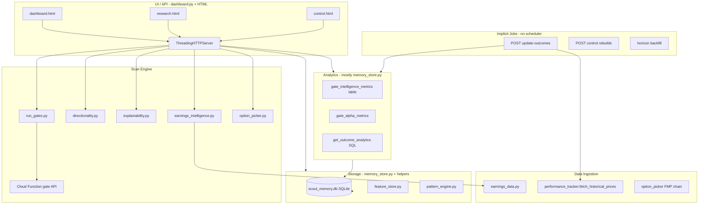

# Scout Sandbox — Infrastructure Hardening Plan (Horizon-1)

**Status:** Planning document (not implemented)  
**Goal:** Scale from hundreds → tens of thousands of stored scans without changing hosting yet  
**Constraints:** Preserve gate scoring, save semantics, manual outcome refresh, and Horizon-1 operator workflows  

---

## Table of Contents

1. [Current Architecture Map](#1-current-architecture-map)
2. [Layer-by-Layer Responsibilities](#2-layer-by-layer-responsibilities)
3. [Sync vs Background vs Cached](#3-sync-vs-background-vs-cached)
4. [What Must Never Run on Page Load](#4-what-must-never-run-on-page-load)
5. [Scaling Risks by Layer](#5-scaling-risks-by-layer)
6. [Top Bottlenecks](#6-top-bottlenecks)
7. [Recommended Module Separation](#7-recommended-module-separation)
8. [Caching Strategy](#8-caching-strategy)
9. [Future Migration Path](#9-future-migration-path)
10. [Priority Order for Hardening Work](#10-priority-order-for-hardening-work)
11. [Research Memory Load Budget](#11-research-memory-load-budget)
12. [What Stays Synchronous by Design](#12-what-stays-synchronous-by-design)
13. [Peer Risk-Adjusted Edge (related plan)](#13-peer-risk-adjusted-edge-related-plan)
14. [Remote access (related plan)](#14-remote-access-related-plan)

---

## 1. Current Architecture Map

### 1.1 System diagram (as-is)



### 1.2 File / module inventory

| File / module | Primary responsibility | Approx. size |
|---------------|------------------------|--------------|
| `scout-gates-sandbox/dashboard.py` | HTTP routing, page serve, run orchestration, serialize scan payload | ~550 lines |
| `scout-gates-sandbox/memory_store.py` | SQLite schema, CRUD, summaries, analytics, backfills, audit | ~4,100 lines |
| `scout-gates-sandbox/run_gates.py` | CLI + `fetch_gate_result` to production gate endpoint | ~290 lines |
| `scout-gates-sandbox/performance_tracker.py` | FMP EOD prices, trading-day horizons, outcome refresh | ~620 lines |
| `scout-gates-sandbox/earnings_data.py` | FMP earnings ingest | ~370 lines |
| `scout-gates-sandbox/earnings_intelligence.py` | Tiered EI scoring | ~330 lines |
| `scout-gates-sandbox/directionality.py` | Bull/bear attribution breakdown | ~450 lines |
| `scout-gates-sandbox/explainability.py` | Gate explanations | ~200 lines |
| `scout-gates-sandbox/option_picker.py` | FMP option chains | ~280 lines |
| `scout-gates-sandbox/feature_store.py` | Feature vectors table | ~390 lines |
| `scout-gates-sandbox/pattern_engine.py` | Pattern intelligence tables | ~270 lines |
| `scout-gates-sandbox/schema_registry.py` | Schema versioning | small |
| `scout-gates-sandbox/engine_version.py` | Engine version metadata | small |
| `scout-gates-sandbox/dashboard.html` | Gate sandbox UI | — |
| `scout-gates-sandbox/research.html` | Research Memory UI | — |
| `scout-gates-sandbox/control.html` | Horizon-1 control panel | — |
| `scout-gates-sandbox/scout_memory.db` | SQLite database (local) | — |

### 1.3 API surface (current)

| Route | Method | Role |
|-------|--------|------|
| `/`, `/dashboard.html` | GET | Gate sandbox UI |
| `/research`, `/research.html` | GET | Research Memory UI |
| `/control`, `/control.html` | GET | Control panel UI |
| `/api/run` | POST | Run gate scan (sequential tickers) |
| `/api/run/save` | POST | Persist scan to SQLite |
| `/api/memory/summary` | GET | Analytics + metrics (no history table) |
| `/api/memory/history` | GET | Paginated scan rows |
| `/api/memory/audit` | GET | Outcome audit log |
| `/api/memory/ticker` | GET | Ticker-filtered history |
| `/api/memory/export.csv` | GET | Batched CSV export |
| `/api/memory/update-outcomes` | POST | FMP outcome refresh + analytics rebuild |
| `/api/memory/create-outcome-test-record` | POST | Sandbox test row |
| `/api/explanation/{id}`, `/api/horizon-trace/{id}` | GET | Single-row explanation |
| `/api/control/summary` | GET | Control panel summary |
| `/api/control/self-audit` | GET | Self-audit |
| `/api/control/patterns` | GET | **Runs pattern rebuild** ⚠️ |
| `/api/control/attribution` | GET | Gate attribution summary |
| `/api/control/gate-alpha` | GET/POST | Gate alpha read / rebuild |
| `/api/control/backfill` | POST | Horizon backfill |
| `/api/control/regime-intelligence` | POST | Regime rebuild |

### 1.4 Critical coupling

`memory_store.py` owns persistence, analytics, control summaries, Research Memory payloads, and several rebuild paths. The API layer (`dashboard.py`) imports it directly for almost every route.

---

## 2. Layer-by-Layer Responsibilities

### 2.1 UI / API layer

**Files:** `dashboard.py`, `dashboard.html`, `research.html`, `control.html`

**Owns:**

- HTTP routing and static page delivery
- Request/response JSON contracts
- Orchestrating scan runs (`build_run_payload`)
- Delegating reads/writes to `memory_store` and engine helpers

**Does not own (target state):**

- SQL queries
- Analytics computation
- FMP HTTP calls on GET paths

---

### 2.2 Scan engine

**Files:** `run_gates.py`, `directionality.py`, `explainability.py`, `earnings_intelligence.py`, `engine_version.py`, serialization in `dashboard.py`

**Owns:**

- Gate execution (via Cloud Function API)
- Scout score presentation and EI attachment
- Directional breakdown and explanations
- Option pick selection for passing tickers

**Does not own:**

- SQLite persistence (except via explicit save endpoint)
- Research Memory analytics

---

### 2.3 Data ingestion

**Files:** `earnings_data.py`, `performance_tracker.py` (prices), `option_picker.py` (chains), raw JSON in `save_scan_result`

**Owns:**

- FMP and external provider HTTP
- Normalizing provider payloads into internal shapes
- Earnings event selection for EI

**Does not own:**

- Page rendering
- Aggregate analytics (except feeding raw inputs at save time)

---

### 2.4 Storage layer

**Files:** `memory_store.py`, `feature_store.py`, `pattern_engine.py`, `scout_memory.db`

**Owns:**

- Schema, migrations, indexes
- Scan persistence (`scan_runs`, `scan_results`)
- Outcome columns and audit logs
- Institutional audit events
- Lightweight vs full row projections (`row_to_history_list` vs `row_to_result`)

**Tables (transactional):**

- `scan_runs`, `scan_results`
- `outcome_update_audit`, `institutional_audit_log`
- `gate_attributions`

**Tables (derived / analytics):**

- `gate_intelligence_metrics`
- `gate_alpha_metrics`
- `pattern_intelligence`
- Feature-vector tables (via `feature_store.py`)

---

### 2.5 Background jobs

**Today:** No scheduler. Jobs are triggered by HTTP POST (and one GET that rebuilds — see bottlenecks).

| Job | Current trigger | Target trigger |
|-----|-----------------|----------------|
| Outcome updater | `POST /api/memory/update-outcomes` | Manual + scheduled |
| Gate intelligence rebuild | End of outcome refresh | Separate job |
| Gate alpha rebuild | Outcome refresh + control POST | Separate job |
| Pattern rebuild | `GET /api/control/patterns` ⚠️ | POST / job only |
| Regime / feature backfill | Control POST | Job with checkpoint |
| Horizon backfill | Control POST | Job |
| Earnings refresh | Inline during scan/EI | Nightly or on-demand job |

---

### 2.6 Analytics / cache layer

**Files:** Functions in `memory_store.py` — `get_outcome_analytics`, `get_gate_intelligence_metrics`, `get_gate_statistics`, `get_direction_accuracy`, `build_memory_summary_payload`, `refresh_*`

**Owns:**

- Precomputed gate intelligence and gate alpha tables
- SQL aggregates for outcome analytics and direction accuracy
- Research Memory summary payload assembly

**Pattern to extend:**

- Materialized tables + snapshot rows for dashboard/summary endpoints

---

### 2.7 System monitoring

**Files:** `log_timing`, `[memory-load]`, `[memory-history]`, `[outcomes]`, `[earnings-ingestion]` stderr logs

**Owns (target):**

- Per-route timing
- DB path and row counts on history requests
- Ingestion failure records
- Cache freshness / stale detection

---

## 3. Sync vs Background vs Cached

### 3.1 Summary matrix

| Layer | Synchronous (user waits) | Background / manual | Cached / precomputed |
|-------|--------------------------|---------------------|----------------------|
| **UI/API** | HTML serve; paginated history; single-row trace; scan run (today) | Outcome update trigger; rebuild triggers | Static assets only (short TTL) |
| **Scan engine** | Per-ticker gate fetch; scoring; explain; EI on serialize | Full universe scans (should be queued) | Optional gate API response cache by day |
| **Ingestion** | Prices/options during scan/outcome (today) | Batch FMP refresh; earnings nightly | `provider_cache` table (future) |
| **Storage** | Single-row read/write transactions | Backfills; exports; archives | Connection pool; read replicas (Postgres) |
| **Jobs** | None on GET | All rebuilds and outcome batches | Job output = derived tables |
| **Analytics** | Read precomputed tables only | All `refresh_*` compute | `gate_intelligence_metrics`, snapshots |
| **Monitoring** | `/api/health` ping | Scheduled self-audit | Metrics tables / log aggregation |

### 3.2 UI / API layer — detail

| Concern | Current | Recommendation |
|---------|---------|----------------|
| **Synchronous** | Static HTML; JSON reads; `/api/run`; `/api/run/save` | Keep: page serve, paginated history, horizon trace |
| **Background / manual** | Outcome update; rebuilds | Never trigger rebuilds from GET |
| **Cached** | None at HTTP layer | API reads from snapshots only |
| **Never on page load** | `GET /api/control/patterns` runs rebuild | Summary/history read precomputed data only |

### 3.3 Scan engine — detail

| Concern | Current | Recommendation |
|---------|---------|----------------|
| **Synchronous** | Per-ticker gate fetch; explanation; direction; EI; options for passers | Deterministic scoring within a scan job |
| **Background / manual** | Full universe scans | Queue scan jobs; return `run_id` + poll |
| **Cached** | None | Optional gate response cache `(ticker, engine_version, day)` |
| **Never on page load** | Entire `/api/run` pipeline | Research Memory must not invoke scan engine |

### 3.4 Data ingestion — detail

| Concern | Current | Recommendation |
|---------|---------|----------------|
| **Synchronous** | EI during serialize; options on scan; FMP on outcome refresh | Defer supplemental FMP to ingestion jobs where possible |
| **Background / manual** | Outcome prices; earnings refresh | Batched with retries and circuit breaker |
| **Cached** | Raw JSON per row only | `provider_cache (provider, symbol, endpoint, as_of, payload, fetched_at)` |
| **Never on page load** | Any FMP HTTP on GET | Strict ban |

### 3.5 Storage — detail

| Concern | Current | Recommendation |
|---------|---------|----------------|
| **Synchronous** | Paginated lightweight SELECT; save transaction; audited outcome UPDATE | Narrow OLTP writes |
| **Background / manual** | Backfills; pattern/alpha rebuild | Job records + progress |
| **Cached** | `_DB_INITIALIZED` per process | Pool; replicas later |
| **Never on page load** | Full table scans; `row_to_result` on lists; `limit=100000` export | Migrations via CLI on deploy |

### 3.6 Background jobs — detail

| Concern | Recommendation |
|---------|----------------|
| **Synchronous** | None inside user-facing GET |
| **Cached** | Output written to derived tables |
| **Never on page load** | All rebuilds and outcome price fan-out |
| **Risk** | `refresh_gate_intelligence_metrics` is O(n) Python over all completed rows |

### 3.7 Analytics — detail

| Metric | Today | At 10k+ scans |
|--------|-------|----------------|
| Outcome analytics | SQL aggregates ✅ | Keep; optional nightly snapshot |
| Direction accuracy | SQL `GROUP BY` ✅ | Keep |
| Gate intelligence | Table read; full recompute on outcome refresh | Incremental on outcome write |
| Gate statistics | Sample 400 rows, parse `gates_json` in Python | Precompute `gate_pass_fail` table |
| Top gate failures | Sample 500 rows | SQL on normalized failed gates |
| Research summary | ~6 queries per load | Single `analytics_snapshot` row |

### 3.8 Monitoring — detail

| Signal | Today | Target |
|--------|-------|--------|
| Timing | stderr `[memory-load]` JSON | Structured: `route`, `db_path`, `duration_ms`, `rows_returned` |
| Slow queries | Ad hoc | Log queries > 100ms |
| API health | None | `GET /api/health` |
| Ingestion failures | Per-row in outcome `errors[]` | `ingestion_failures` table |
| Stale cache | `freshness_status` in control | Alert when `computed_at` > 24h or row_count drift |

---

## 4. What Must Never Run on Page Load

The following must **not** execute during Research Memory, dashboard, or control **GET** page loads:

- Outcome refresh (`update_outcomes`)
- FMP / external provider HTTP
- `refresh_gate_intelligence_metrics`
- `refresh_gate_alpha_metrics`
- `rebuild_patterns` / `rebuild_regime_intelligence`
- Horizon backfill
- Full-table Python scans over `scan_results`
- `get_ticker_history(limit=100000)` or unbounded export
- `row_to_result` on list endpoints
- Self-audit full scan (move to scheduled job)
- `GET /api/control/patterns` rebuild (today violates this)

**Allowed on load:**

- `init_db()` once per process (migrations)
- Paginated `HISTORY_SELECT_SQL` reads
- Reading `gate_intelligence_metrics` and SQL aggregates
- `count_scan_results()` for totals

---

## 5. Scaling Risks by Layer

### 5.1 UI / API

- `ThreadingHTTPServer` — no backpressure; fragile under concurrent Research Memory + scans
- No request timeouts or auth
- Large JSON responses (full scan payloads)
- Scan run holds thread for `N × timeout` seconds

### 5.2 Scan engine

- Sequential ticker loop in `build_run_payload`
- Duplicate serialization for winner + rejected + results
- EI may trigger FMP during scan
- No idempotency key on save

### 5.3 Data ingestion

- N×FMP calls per outcome batch
- No shared price cache across tickers
- Provider errors surfaced per row only

### 5.4 Storage

- `memory_store.py` god module (~4k lines)
- Large JSON columns: `raw_result_json`, `gate_snapshot_json`, `gates_json`
- SQLite single-writer lock contention
- `SELECT *` in outcome updater
- Missing covering indexes for filter combinations

### 5.5 Background jobs

- No job abstraction — rebuilds run inline on HTTP thread
- Outcome refresh triggers full analytics recompute
- No retry, checkpoint, or deduplication

### 5.6 Analytics

- Sampled metrics (`get_gate_statistics(400)`) diverge from truth at scale
- Stale cache undetected in UI
- `refresh_gate_intelligence_metrics` loads all completed rows into Python

### 5.7 Monitoring

- stderr-only logs lost on restart
- No single health endpoint for operators

---

## 6. Top Bottlenecks

Ordered by impact at 10,000+ scans:

| # | Bottleneck | Location | Why it breaks |
|---|------------|----------|---------------|
| 1 | God module `memory_store.py` | All layers | Untestable; accidental page-load work; merge conflicts |
| 2 | Analytics rebuild on outcome refresh | `performance_tracker.update_outcomes` → `refresh_gate_intelligence_metrics` | O(n) Python over all completed rows every batch |
| 3 | Large JSON blob reads | `scan_results.raw_*`, `gate_snapshot_json` | List views load MB per page without strict column sets |
| 4 | SQLite single-writer | All writes during save + outcome + rebuild | Lock contention; long transactions |
| 5 | Sequential scan HTTP | `build_run_payload` loop | Wall-clock = N × timeout |
| 6 | Sampled vs full analytics | `get_gate_statistics(400)`, `get_top_gate_failures(500)` | Misleading metrics at scale |
| 7 | GET triggers rebuild | `/api/control/patterns` | Accidental load triggers full recompute |
| 8 | No job abstraction | Rebuilds inline with HTTP | Timeouts; partial failure; no retry |
| 9 | ThreadingHTTPServer | `dashboard.py` | No backpressure under concurrent users |
| 10 | FMP fan-out | Outcomes + EI + options | Rate limits; flaky latency |

---

## 7. Recommended Module Separation

### 7.1 Target directory layout

```
scout-gates-sandbox/
  api/
    server.py              # HTTP entry (future ASGI)
    routes/
      memory.py            # summary, history, audit, export
      scans.py             # run, save
      control.py           # rebuild triggers (POST only)
      health.py
    schemas/               # response contracts
  engine/
    gates/                 # gate definitions, pass/fail
    scoring/               # scout score, EI adjustment inputs
    direction/             # directionality.py
    explain/               # explainability.py
    runner/                # orchestration, Cloud Function client
  ingestion/
    fmp/                   # client, rate limit, errors
    earnings/              # earnings_data.py
    prices/                # historical EOD
    options/               # chains
    normalize/             # provider → internal schema
  storage/
    db.py                  # connect, migrate, pool
    migrations/
    repos/
      scans.py
      outcomes.py
      audit.py
      analytics_read.py
  analytics/
    compute/               # refresh_* logic (jobs only)
    read/                  # summary builders (API only)
    snapshots/
  jobs/
    runner.py
    handlers/
      outcome_refresh.py
      gate_intelligence.py
      gate_alpha.py
      patterns.py
  monitoring/
    timing.py
    health.py
  web/                     # HTML or separate SPA
    dashboard.html
    research.html
    control.html
```

### 7.2 Dependency rules

```
api → analytics.read → storage.repos   (reads only)
jobs → analytics.compute → storage     (writes + recompute)
engine → ingestion (optional)          (no storage)
ingestion → (no api, no analytics.read)
```

**Hard rules:**

- `engine` never imports `storage`
- `ingestion` never imported by API GET handlers
- `analytics.compute` never called from page-load code paths

---

## 8. Caching Strategy

### 8.1 Tier 0 — Already in place

- `gate_intelligence_metrics`, `gate_alpha_metrics`, `pattern_intelligence` as materialized tables
- `row_to_history_list` / `HISTORY_SELECT_SQL` column pruning
- `init_db()` once per process (`_DB_INITIALIZED`)
- Split Research Memory: `/api/memory/summary` + `/api/memory/history`

### 8.2 Tier 1 — Add on SQLite (no new infra)

| Cache key | Stored in | Invalidated when |
|-----------|-----------|------------------|
| `research_summary_v{engine}_{row_count}` | `analytics_snapshots` table | Outcome refresh, scan save, manual rebuild |
| `gate_stats_v{hash}` | `analytics_snapshots` | Scan save, gate definition change |
| `provider_prices_{ticker}_{from}_{to}` | `provider_cache` | Daily or manual refresh |

### 8.3 Tier 2 — Read path contract

- **Summary endpoint:** read snapshot if fresh (< 1h and `row_count` matches), else compute once and upsert
- **History endpoint:** never compute analytics; only paginated `scan_results` projection
- **Export:** stream batches; never build full list in memory

### 8.4 Tier 3 — Staleness UX

Return on aggregate endpoints:

```json
{
  "meta": {
    "computedAt": "2026-05-19T12:00:00Z",
    "sourceRowCount": 169,
    "engineVersion": "horizon-1.x"
  }
}
```

Control panel: **READY** / **STALE** / **REBUILDING** per cache segment.

---

## 9. Future Migration Path

### 9.1 Phases

| Phase | Storage | API | Jobs | Scale target |
|-------|---------|-----|------|--------------|
| **0 (now)** | SQLite file | `ThreadingHTTPServer` | HTTP POST | Hundreds of scans |
| **1** | SQLite + WAL + indexes | Same; stricter route guards | CLI job runner | Low thousands |
| **2** | Postgres (local Docker) | FastAPI + uvicorn | APScheduler or cron + worker | Tens of thousands |
| **3** | Postgres (RDS / Cloud SQL) | Separated read API | Queue (SQS / Pub/Sub) + workers | Multi-user |
| **4** | Postgres + object store for raw JSON | CDN for static UI | Dedicated ingestion service | 100k+ / archive |

### 9.2 Schema migration principles

1. **Normalize hot fields first:** `ticker`, `timestamp`, `scout_score`, `final_direction`, `stock_outcome_label`, return horizons, `engine_version`
2. **Move blobs to side storage:** `raw_result_json`, `gate_snapshot_json` → `scan_result_payloads` table or S3
3. **Replace JSON gate parsing** with `scan_result_gates (scan_id, gate_key, passed)` junction table
4. **Use Postgres `JSONB`** only where truly schemaless
5. **Dual-write window:** export SQLite → import Postgres; compare `row_count` and aggregate checksums before cutover

### 9.3 Postgres benefits at scale

- Concurrent readers during writes (vs SQLite single-writer)
- Better query planner for analytics aggregates
- Native partial indexes on outcome labels and direction
- Logical replication for read replicas

---

## 10. Priority Order for Hardening Work

| Priority | Work item | Effort | Impact |
|----------|-----------|--------|--------|
| **P0** | Document stable API contracts (`history`, `filteredTotal`, `debug`); ban rebuild on GET (`/api/control/patterns`) | S | Prevents accidental load catastrophes |
| **P0** | Split outcome refresh: Phase A = prices/labels; Phase B = analytics jobs | M | Largest win for Research Memory reliability |
| **P1** | Extract `storage/repos` from `memory_store.py` (read vs write) | L | Enables all other splits |
| **P1** | `analytics_snapshot` table for `/api/memory/summary` | M | Sub-200ms summary at 10k rows |
| **P1** | Incremental `refresh_gate_intelligence_metrics` (SQL or delta) | L | Outcome refresh stops scaling O(n) |
| **P2** | Normalize failed gates + gate stats (stop Python JSON loops) | M | Correct analytics at scale |
| **P2** | Job runner + `job_runs` table | M | Retries, progress, off HTTP thread |
| **P2** | Provider price cache table | M | Dedupe FMP |
| **P3** | Scan job queue (async `/api/run`) | L | Universe scans |
| **P3** | Monitoring: `/api/health`, slow-query log, cache freshness | S | Operability |
| **P4** | WAL mode + index review + cold archive policy | M | Raise SQLite ceiling |
| **P5** | Postgres migration design + dual-run | XL | 10k–100k+ |

**Recommended first implementation slice (still on SQLite):** P0 + split outcome refresh + `analytics_snapshot` for summary.

---

## 11. Research Memory Load Budget

Target behavior at 10,000 stored scans:

| Step | Endpoint | Allowed work | Target latency |
|------|----------|--------------|----------------|
| 1 | `GET /api/memory/summary` | Read snapshot + 1 count query | < 100ms |
| 2 | `GET /api/memory/history?limit=10&offset=0` | Indexed paginated SELECT, lightweight columns | < 50ms |
| 3 | `GET /api/memory/audit?limit=50` | Paginated audit log | On tab click only |

**Initial load defaults:**

- Page size: **10 rows**
- Filters: **none** (show all saved scans)
- No failed-gate placeholder applied as a filter

**Never on load:**

- Outcome refresh
- FMP HTTP
- Any `refresh_*` function
- Full CSV export
- `row_to_result` on lists
- Backfill or pattern rebuild

---

## 12. What Stays Synchronous by Design

These paths remain synchronous for determinism and audit integrity:

- Gate scan scoring path (operator expects immediate result per ticker)
- Save-to-memory transaction (`POST /api/run/save`)
- Single-row Horizon Trace / explanation fetch
- Paginated history row fetch (bounded `limit` ≤ 500)

---

## 13. Peer Risk-Adjusted Edge (related plan)

PRAE is documented separately in **[peer-risk-adjusted-edge.md](./peer-risk-adjusted-edge.md)** (architecture + scoring plan). It does not change infrastructure layers above, but must obey the same constraints:

| Hardening rule | PRAE compliance |
|----------------|-----------------|
| No compute on Research Memory GET | Peer stats read from `raw_result_json` / snapshots only |
| No FMP on page load | v1 peer cohort uses in-run gate API fields only |
| No gate pass/fail mutation | Breakdown + optional capped adjustment only |
| Scan path stays synchronous (small N) | O(N) in-memory; queue if N > 100 (P4) |

**Insertion point:** `dashboard.build_run_payload` after all gate fetches, before `serialize_result` — not inside `memory_store` summary builders.

**Caching alignment:** Tier 0 in-run memo (per scan); Tier 1b `analytics_snapshots` on save (P2). See peer doc §8.

**Module:** `scout-gates-sandbox/peer_risk_adjusted_edge.py` (P0 breakdown implemented).

---

## 14. Remote access (related plan)

Private phone/laptop access to the sandbox dashboard (without public deploy) is documented in **[remote-access-plan.md](./remote-access-plan.md)**.

| Topic | Plan location |
|-------|----------------|
| Tailscale-first topology | remote-access §2 |
| Ports (`8765` dashboard vs `3000` Next.js) | remote-access §5 |
| Auth before remote use | remote-access §7 |
| `.env` / FMP key handling | remote-access §8 |
| Cloudflare Tunnel fallback | remote-access §9 |

**Constraint:** Hardening “no FMP on page load” and “no public dashboard” apply equally to remote access — Tailscale does not replace application auth.

---

## Appendix A — Response shape reference (Research Memory)

Current history API response (stable contract):

```json
{
  "ok": true,
  "history": [ "..." ],
  "total": 169,
  "filteredTotal": 169,
  "limit": 10,
  "offset": 0,
  "timings": { "row_fetch_ms": 5.2, "count_ms": 0.3, "total_ms": 6.1 },
  "debug": {
    "dbPath": "/path/to/scout_memory.db",
    "total": 169,
    "filteredTotal": 169,
    "returned": 10,
    "limit": 10,
    "offset": 0,
    "filters": {
      "ticker": null,
      "outcome": null,
      "direction": null,
      "failedGate": null,
      "minScore": null,
      "maxScore": null
    }
  }
}
```

Frontend should read `data.history` (with fallbacks `rows`, `records`, `items` optional during transition).

---

## Appendix B — Logging conventions (target)

```text
[memory-load] summary {"outcome_analytics_ms": 95, "total_ms": 120}
[memory-history] db=... total=169 filtered=169 returned=10 limit=10 offset=0 filters={...}
[dashboard] /api/memory/history db=... total=169 filtered=169 returned=10 limit=10 offset=0 filters={...}
[outcomes] row=42 ticker=NVDA label=WIN resolved=[1D,5D] pending=[20D]
[earnings-ingestion] NVDA selected_event=2026-01-28 ...
```

---

## Appendix C — Document history

| Date | Change |
|------|--------|
| 2026-05-19 | Initial plan — planning only, no implementation |
| 2026-05-21 | Added §13 cross-reference to Peer Risk-Adjusted Edge plan |
| 2026-05-21 | Added §14 cross-reference to Remote Access plan |

---

*This document describes intended future architecture. Behavior of the running sandbox may differ until hardening work is implemented.*
