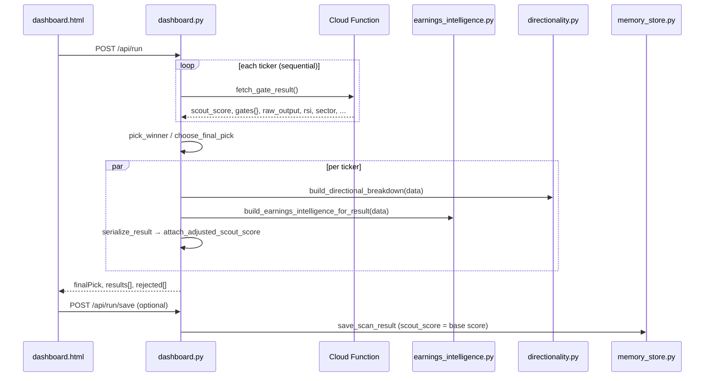
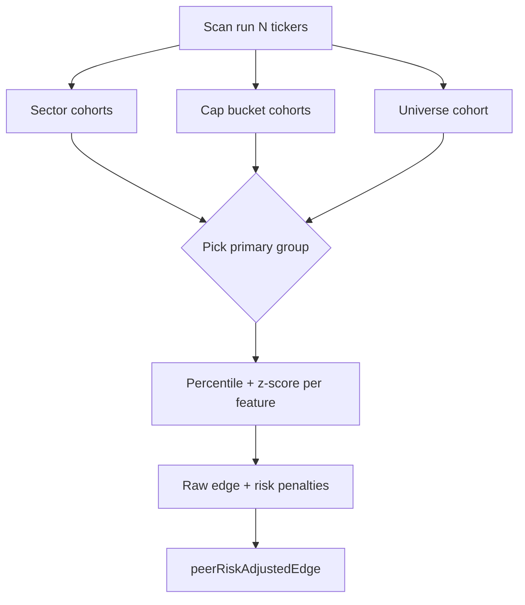
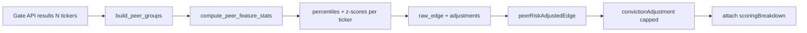

# Peer Risk-Adjusted Edge — Architecture & Scoring Plan

**Status:** Planning document (not implemented)  
**Scope:** `scout-gates-sandbox` Horizon-1 gate sandbox  
**Code stub:** `scout-gates-sandbox/peer_risk_adjusted_edge.py` (constants + interfaces only)  
**Goal:** Add peer-relative scoring as a **low-influence enrichment layer** without changing production gate pass/fail or base Scout score authority  

---

## Table of Contents

1. [Executive summary](#1-executive-summary)
2. [Current scoring pipeline](#2-current-scoring-pipeline)
3. [Gate weighting flow (today)](#3-gate-weighting-flow-today)
4. [What exists vs what is planned](#4-what-exists-vs-what-is-planned)
5. [Safest insertion point](#5-safest-insertion-point)
6. [Proposed module design](#6-proposed-module-design)
7. [Peer group construction](#7-peer-group-construction)
8. [Caching strategy](#8-caching-strategy)
9. [Performance impact estimate](#9-performance-impact-estimate)
10. [Avoiding conflicts with momentum and quality](#10-avoiding-conflicts-with-momentum-and-quality)
11. [Fallback behavior for missing peer data](#11-fallback-behavior-for-missing-peer-data)
12. [Keeping sub-gate influence capped](#12-keeping-sub-gate-influence-capped)
13. [Sharpe ratio and t-stat (planned semantics)](#13-sharpe-ratio-and-t-stat-planned-semantics)
14. [Persistence and reporting contract](#14-persistence-and-reporting-contract)
15. [Implementation phases](#15-implementation-phases)
16. [Open questions](#16-open-questions)
17. [Scoring plan (formulas & rollout)](#17-scoring-plan-formulas--rollout)
18. [Acceptance criteria & test matrix](#18-acceptance-criteria--test-matrix)

---

## 1. Executive summary

Scout’s **authoritative** score and gate outcomes come from the deployed Cloud Function (`friday-scout`, single-ticker JSON). The sandbox adds **Earnings Intelligence (EI)** as a capped adjustment to `adjustedScoutScore`, **directionality** as a separate bull/bear read, and **within-scan ranking** at save time.

**Peer Risk-Adjusted Edge (PRAE)** should follow the same pattern as EI:

- Compute **after** the gate API returns, using fields already on the scan payload.
- Attach results under `scoringBreakdown` / `peerContext` for UI and PDF export.
- Apply at most a **small** optional score nudge (separate from gate booleans and from EI’s earnings cap).
- Never re-run gates, never block saves, never run on Research Memory page load.

PRAE is **not** implemented in scoring logic today. PDF export (`reporting/scoring_breakdown.py`) already **reads** optional fields if present; tests in `gates_test.py` use mock `scoringBreakdown` payloads only.

---

## 2. Current scoring pipeline

### 2.1 End-to-end flow (as-is)



### 2.2 Layer responsibilities

| Layer | Location | Mutates `scout_score`? | Mutates gate pass/fail? | Affects winner pick? |
|-------|----------|--------------------------|-------------------------|----------------------|
| **Gate engine (remote)** | Cloud Function | Yes — `scout_score` | Yes — 14 booleans | Yes — via score + pass filter |
| **Winner selection** | `run_gates.choose_final_pick` | No | No (filters pool) | Yes — `max(score)` among passers |
| **Earnings Intelligence** | `earnings_intelligence.py` | Indirect — `adjustedScoutScore` only | No | No (pick uses base `score`) |
| **Directionality** | `directionality.py` | No | No | No |
| **Post-save ranks** | `memory_store.build_rank_maps` | No | No | No (metadata only) |
| **Gate attribution** | `memory_store.build_gate_attributions` | No | No | No (retrospective %) |
| **Pattern intelligence** | `pattern_engine.py` | No | No | No (historical cohorts) |

### 2.3 Key code anchors

**Remote fetch and base score:**

```149:181:scout-gates-sandbox/run_gates.py
def fetch_gate_result(api_url: str, ticker: str, timeout: float) -> CandidateResult:
    ...
def choose_final_pick(results: list[CandidateResult]) -> CandidateResult:
    passing = [result for result in results if result.passed_all_gates]
    pool = passing or results
    return max(pool, key=lambda result: result.score)
```

**Serialization and EI attachment (per ticker, no cross-ticker context today):**

```81:113:scout-gates-sandbox/dashboard.py
def serialize_result(...) -> dict[str, Any]:
    earnings_intelligence = build_earnings_intelligence_for_result(result.data)
    payload = { "score": result.score, ... }
    return attach_adjusted_scout_score(payload, earnings_intelligence)
```

**EI adjustment cap (precedent for low-influence sub-layer):**

```21:29:scout-gates-sandbox/earnings_intelligence.py
DEFAULT_CONVICTION_CAP = 8
...
SECONDARY_GATE_REFERENCE_WEIGHT = 0.35
```

```712:724:scout-gates-sandbox/earnings_intelligence.py
def attach_adjusted_scout_score(serialized, intelligence):
    base_score = float(serialized.get("score") or 0)
    adjustment = int(intelligence.get("conviction_adjustment") or 0)
    ...
    serialized["adjustedScoutScore"] = apply_scout_score_adjustment(base_score, adjustment)
```

**SQLite persists base score, not `adjustedScoutScore`:**

```1105:1105:scout-gates-sandbox/memory_store.py
                    result.get("score"),
```

---

## 3. Gate weighting flow (today)

There is **no single weight table** that produces `scout_score` in this repository. Weighting appears in four **separate** systems:

### 3.1 Production gates — strict AND, no weights

```84:85:scout-gates-sandbox/run_gates.py
def passed_all_gates(self) -> bool:
    return all(self.gates.get(key) is True for key, _, _ in GATES)
```

All 14 gates (`sentinel` … `fortress`) must pass. Order defines `first_failed_gate` only.

### 3.2 Directionality — narrative weights (not Scout score)

`build_directional_breakdown` assigns ad hoc signal weights (RSI, daily `change`, sector `wind`, parsed `raw_output` lines). EI dampens earnings-related lines on Event Trigger / Intel Feed / Volatility Read to **35%** when EI is active:

```288:304:scout-gates-sandbox/earnings_intelligence.py
def secondary_gate_weight(gate_display_name, line_text, earnings_context) -> float:
    ...
    return float(earnings_context.get("secondary_gate_multiplier", SECONDARY_GATE_REFERENCE_WEIGHT))
```

Direction is **anchored** to API `direction` (+25 / opposing ×0.65). This is transparency-only for the modal; it does not change `choose_final_pick`.

### 3.3 Post-save gate attribution — retrospective %

```608:661:scout-gates-sandbox/memory_store.py
def attribution_gate_score(gate):
    ...
    return 1.0 if gate.get("passed") else 0.35
# contribution_pct = gate_weight / total_weight * 100
```

Uses parsed `score: N` from gate explanation text when present.

### 3.4 Feature store metadata — unused in live scoring

```11:13:scout-gates-sandbox/feature_store.py
TECHNICAL_FLOW_WEIGHT = 0.60
MACRO_SECTOR_WEIGHT = 0.25
FUNDAMENTALS_WEIGHT = 0.15
```

Written to `layer_weights_json`; **no composite formula** consumes these during `/api/run`.

### 3.5 Gate ↔ momentum / quality (implicit, not a PRAE layer)

| Concept | Where it lives | Mechanism |
|---------|----------------|-----------|
| **Momentum language** | `directionality.py` | RSI, daily `change` ±2%, Trend Lock text |
| **Flow momentum** | Gate 12 `current` (Flow Analysis) | Pass/fail via Cloud Function |
| **EI quality** | `score_quality_modifier` | Beat/miss vs guidance vs reaction consistency |
| **Threat / quality flags** | Gate 6 `specter`, `risk_flags_for_result` | Bear signals; audit flags only |

PRAE must **not** duplicate these rules as a second pass/fail filter.

---

## 4. What exists vs what is planned

| Capability | Today | PRAE target |
|------------|-------|-------------|
| `peerRiskAdjustedEdge` | Read by PDF export only | Computed per ticker per scan |
| `sharpeRatio`, `tStat` | Not in codebase | Optional stats over peer return window |
| Universe / sector rank | `build_rank_maps` at **save** on base `score` | Same scan, richer percentile + z-scores |
| Peer cohort | Scan universe only (implicit) | Tiered peer groups (see §7) |
| Score adjustment | EI ±`conviction_cap` (6–10) | Separate small cap (recommended ≤5) |
| Historical peers | `pattern_engine.feature_similarity` | Read-only prior; not live scan |

---

## 5. Safest insertion point

### 5.1 Recommended: post-fetch, pre-serialize (run-level)

**Where:** `dashboard.build_run_payload`, after all `fetch_gate_result` calls succeed and **before** the per-ticker `serialize_result` loop.

**Why this is safest:**

1. **Peer scoring is inherently cross-sectional** — needs all tickers in the run (or a cached cohort).
2. **Does not touch** Cloud Function contracts or gate booleans.
3. **Runs once per universe** — O(N) in-memory stats vs N× HTTP gate calls (dominant cost today).
4. **Mirrors** `build_rank_maps` placement (today at save; should move earlier for live UI).
5. **Single attach point** — pass `peer_context_by_ticker` into `serialize_result`, same pattern as `direction_breakdown`.

### 5.2 Avoid these insertion points

| Location | Risk |
|----------|------|
| Inside `fetch_gate_result` | No peer cohort yet; would require N+1 API or batch API |
| Inside `directionality.py` | Blurs conviction math; re-weights narrative signals |
| Inside `earnings_intelligence.py` | Couples two adjustment layers; hard to cap independently |
| `choose_final_pick` / winner | Changes operator-facing picks without explicit opt-in |
| `save_scan_result` / Research Memory GET | Violates “no compute on page load” hardening rules |
| `refresh_gate_intelligence_metrics` | Batch job latency; wrong lifecycle |

### 5.3 Proposed call shape (pseudocode — not implemented)

```python
# build_run_payload, after results[] populated:
peer_bundle = build_peer_risk_context_for_run(results, run_timestamp)
for result in results:
    serialize_result(
        result,
        ...,
        peer_context=peer_bundle.get(result.ticker),
    )
```

---

## 6. Proposed module design

New standalone module (mirroring EI):

```
scout-gates-sandbox/
  peer_risk_adjusted_edge.py   # compute + attach
  peer_groups.py               # cohort selection (optional split)
```

### 6.1 Public functions (planned)

| Function | Role |
|----------|------|
| `build_peer_groups(scan_results)` | Returns cohort memberships per ticker |
| `compute_peer_metrics(ticker, group, fields)` | Percentiles, z-scores, raw edge |
| `compute_risk_adjusted_edge(metrics)` | Combine into `peerRiskAdjustedEdge` |
| `compute_sharpe_and_tstat(...)` | Optional; requires return series |
| `build_scoring_breakdown(...)` | Full `scoringBreakdown` object |
| `attach_peer_scoring(serialized, breakdown)` | Add fields; optional tiny score cap |

### 6.2 Output contract (aligned with PDF export)

```json
{
  "scoringBreakdown": {
    "active": true,
    "mode": "scored",
    "peerRiskAdjustedEdge": 1.24,
    "sharpeRatio": 1.08,
    "tStat": 2.31,
    "peerRiskAdjustedEdgeBreakdown": {
      "rawEdge": 1.8,
      "riskAdjustment": -0.2,
      "peerAdjustment": -0.36,
      "sectorAdjustment": 0.0,
      "volatilityPenalty": 0.0,
      "liquidityPenalty": 0.0,
      "finalEdge": 1.24
    },
    "peerContext": {
      "primaryGroup": "sector",
      "peerCount": 8,
      "universePercentile": 82,
      "sectorPercentile": 71
    },
    "convictionAdjustment": 2,
    "convictionCap": 5,
    "antiDoubleCount": {
      "primaryInterpreter": false,
      "message": "Peer edge is informational; gates unchanged."
    }
  }
}
```

`reporting/scoring_breakdown.py` already maps these keys — **no export changes required** once scoring populates them.

### 6.3 Adjustment stacking order (planned)

```
scoutScoreBase        ← Cloud Function scout_score (immutable authority)
earningsConvictionAdjustment  ← EI (existing, cap ~8)
peerConvictionAdjustment      ← PRAE (new, cap ≤5 recommended)
adjustedScoutScore    ← base + EI + peer (explicit order in attach layer)
```

**Winner pick** should remain on `scoutScoreBase` (or documented opt-in `pickMode: peer_adjusted` later).

---

## 7. Peer group construction

Peer groups should be **tiered**, using data already on the gate payload or feature vector — no new FMP fan-out on v1.

### 7.1 Group hierarchy (recommended)

| Tier | Group key | Membership rule | Min size | Use when |
|------|-----------|-----------------|----------|----------|
| **G0** | `scan_universe` | All tickers in current `/api/run` | 2 | Always available |
| **G1** | `sector` | Same `sector` string from API | 3 | Sector field present |
| **G2** | `market_cap_bucket` | `mega` / `large` / `mid` / `small` / `micro` from `market_cap` | 3 | Cap field present |
| **G3** | `volatility_regime` | `iv_percentile` or ATR buckets (reuse `pattern_engine` logic) | 3 | IV/ATR present |
| **G4** | `historical_cohort` | `pattern_engine` signature match on past `feature_vectors` | 10 | Background job only (v2+) |

**Primary peer group** selection:

1. Prefer **G1 sector** if `len(sector_peers) >= MIN_PEER_COUNT`.
2. Else **G2 cap bucket** if sufficient.
3. Else fall back to **G0 scan_universe**.
4. Never use G4 on synchronous scan path (too heavy).

### 7.2 Metrics to rank within a group

Use a small **feature vector** per ticker from API fields (already used by directionality / feature store):

| Feature | Source field | Notes |
|---------|--------------|-------|
| Scout score | `scout_score` | Primary rank input |
| RSI | `rsi` | Relative overbought/oversold |
| Daily change | `change` | Short-term momentum |
| Sector wind | `wind` | Sector flow |
| Beta | `beta` | Risk adjustment input |
| IV percentile | `iv_percentile` / `iv_rank` | Volatility penalty |
| DCF gap | `dcf_gap` | Valuation stretch |

PRAE **ranks** these vs peers; it does not re-apply gate thresholds.

### 7.3 Peer group diagram



---

## 8. Caching strategy

### 8.1 Tier 0 — In-run memo (required for v1)

| Cache key | Scope | Invalidation |
|-----------|-------|--------------|
| `peer_snapshot:{runTimestamp}:{hash(candidates)}` | Single `/api/run` | End of request |

Store:

- Sorted peer lists per group
- Precomputed percentiles / means / stddevs
- Group membership map

**Cost:** O(N × F) per run, N = universe size, F = small feature count (~6). Negligible vs gate HTTP.

### 8.2 Tier 1 — SQLite `provider_cache` (from hardening plan)

For v2 cross-run peers (same sector daily snapshot):

| Key | Value |
|-----|-------|
| `(provider, symbol, endpoint, as_of)` | Normalized peer fundamentals / returns |

Invalidated daily or on manual refresh. **Not on page load.**

### 8.3 Tier 1b — `analytics_snapshots` row per run

Store serialized `peer_snapshot` on save:

- `scan_session_id` + `engine_version` + `row_count`
- Enables Research Memory to **read** precomputed peer stats without recomputation

### 8.4 Tier 2 — Historical cohort cache (pattern engine)

Reuse `pattern_intelligence` aggregates as **prior** for Sharpe/t-stat — display-only until sample size ≥ threshold.

### 8.5 What not to cache on GET

Research Memory `/api/memory/summary` and `/api/memory/history` must **read** stored `scoringBreakdown` from `raw_result_json` / snapshot — never invoke `build_peer_groups` on load.

---

## 9. Performance impact estimate

### 9.1 Baseline (today)

| Step | Complexity | Typical cost (5 tickers) |
|------|------------|---------------------------|
| Gate API loop | O(N) sequential HTTP | 5 × 2–25s timeout bound |
| EI per ticker | O(N) FMP merge potential | +0–20s (duplicate calls in DIR + serialize) |
| Directionality | O(N) parse `raw_output` | <100ms total |
| Option picker | O(passers) FMP | +1–5s per passer |

### 9.2 PRAE incremental (v1, in-run only)

| Step | Complexity | Estimate |
|------|------------|----------|
| Build peer groups | O(N) | <5ms for N≤50 |
| Percentile / z-score | O(N × G × F) | <20ms for N≤50, G≤3 groups, F≈6 |
| Sharpe / t-stat (universe) | O(N × W) | W = window days; skip v1 if no return series |
| Attach breakdown | O(N) | <5ms |

**Expected overhead:** <1% of wall-clock for typical universes — **dominated by existing gate HTTP**.

### 9.3 Risk hotspots to avoid

| Anti-pattern | Impact |
|--------------|--------|
| Per-ticker FMP for peer fundamentals | N× HTTP; rate limits |
| Recomputing peers on save + on export | Duplicate O(N) |
| Computing peers on history GET | Breaks load budget at 10k rows |
| Sharpe over full `scan_results` table inline | O(database) on request path |

### 9.4 Scale breakpoints

| Universe size | Recommendation |
|---------------|----------------|
| N ≤ 30 | Sync compute in `build_run_payload` |
| 30 < N ≤ 100 | Sync with feature sampling; warn in UI |
| N > 100 | Queue peer job (reuse `reporting` job worker pattern) |

---

## 10. Avoiding conflicts with momentum and quality

### 10.1 Separation of concerns

| System | Question it answers | PRAE must |
|--------|---------------------|-----------|
| **Gates (CF)** | “Did it pass structural rules?” | Never override booleans |
| **EI quality_modifier** | “Are earnings signals internally consistent?” | Stay independent; separate cap |
| **Directionality** | “What bull/bear narrative explains direction?” | No heavy re-weight of signals |
| **PRAE** | “How strong is this name **vs relevant peers**?” | Rank only; flag only |

### 10.2 Specific conflict rules

1. **Do not** fail/pass gates from peer percentiles (e.g. “bottom quartile RSI” ≠ gate fail).
2. **Do not** add RSI/change/momentum thresholds in PRAE — gates and directionality already encode them.
3. **Do not** fold `score_quality_modifier` into peer edge — different axes (internal consistency vs cross-sectional rank).
4. **Do not** multiply `bear_raw` / `bull_raw` in directionality by peer factors — at most add a **single** low-weight “Peer Relative” line item (display).
5. **Do** use `risk_flags_for_result` for **flags** only (e.g. `"Bottom quartile vs sector peers"`) — not score penalties.

### 10.3 EI anti-double-count precedent

EI already reduces secondary gate reference weight to 35% when active. PRAE should expose explicit metadata:

```json
"antiDoubleCount": {
  "eiActive": true,
  "peerReferenceWeight": 0.25,
  "message": "Peer edge does not re-parse earnings or momentum gates."
}
```

When EI is active, PRAE conviction cap should shrink (e.g. 5 → 3) to limit stacked adjustments.

---

## 11. Fallback behavior for missing peer data

### 11.1 Mode enum (mirror EI)

| Mode | Condition | UI / PDF behavior |
|------|-----------|-------------------|
| `unavailable` | Run not `ok` | Hide PRAE section |
| `insufficient_peers` | Group size < `MIN_PEER_COUNT` (recommended 3) | Show ranks vs universe only; edge = `null` |
| `missing_sector` | No sector on ticker | Use G0 universe only; note in `status_message` |
| `partial_features` | <50% features present | Compute edge on available features; `confidence: low` |
| `scored` | Normal path | Full breakdown + Sharpe/t-stat if window available |
| `deferred` | N > sync threshold | Job queue; poll like PDF export |

### 11.2 Numeric fallbacks

| Output | Missing data behavior |
|--------|----------------------|
| `peerRiskAdjustedEdge` | `null` (PDF shows `—`) |
| `peerRiskAdjustedEdgeBreakdown.*` | Component `null`; don't impute zero |
| `sharpeRatio` / `tStat` | `null` unless ≥ `MIN_RETURN_SAMPLES` (recommended 20) |
| `universePercentile` | `null` if N < 2 |
| `sectorPercentile` | `null` if sector group < 3 |
| `convictionAdjustment` | `0` |
| `adjustedScoutScore` | Unchanged from EI-adjusted value |

### 11.3 Status messages (operator-facing)

Examples:

- `"Peer edge unavailable: only 2 names in sector cohort (min 3). Universe percentile shown."`
- `"Sharpe/t-stat require outcome history — pending until returns are backfilled."`

---

## 12. Keeping sub-gate influence capped

### 12.1 Design principles

1. **Gates remain the constitution** — PRAE is commentary + micro-adjustment.
2. **Separate cap from EI** — recommended `PEER_CONVICTION_CAP = 5` (configurable), independent of `DEFAULT_CONVICTION_CAP = 8`.
3. **Order of operations** — apply EI first, then peer, so caps are auditable per layer.
4. **Default off for picking** — `choose_final_pick` uses `scoutScoreBase` unless `pickMode` explicitly extended later.
5. **Reference weight for narrative only** — if directionality lists peer signal, use `PEER_REFERENCE_WEIGHT ≤ 0.25` (≤ EI’s 0.35).

### 12.2 Recommended caps

| Knob | Suggested value | Rationale |
|------|-----------------|-----------|
| `PEER_CONVICTION_CAP` | 5 | Smaller than EI; peer signal noisier on small N |
| `PEER_CONVICTION_CAP` (when EI active) | 3 | Stacked adjustments bounded |
| `PEER_REFERENCE_WEIGHT` | 0.25 | Directionality mention only |
| `MAX_EDGE_MAGNITUDE` | 2.0 | Clamp `peerRiskAdjustedEdge` before mapping to points |
| `MIN_PEER_COUNT` | 3 | Avoid meaningless percentiles |

### 12.3 Mapping edge → points (planned)

Use monotonic squash (example):

```
peer_points = round(clamp(peerRiskAdjustedEdge * 2, -PEER_CONVICTION_CAP, PEER_CONVICTION_CAP))
```

Linear, auditable, invertible in UI tooltips — avoid compounding multipliers across breakdown components.

---

## 13. Sharpe ratio and t-stat (planned semantics)

Not implemented today. Planned definitions for when return data exists:

### 13.1 Inputs

- Per-ticker returns: `return_1d` … `return_20d` from `scan_results` (post-outcome refresh), or FMP EOD batch
- Peer window: same primary peer group as edge breakdown

### 13.2 Definitions

| Metric | Formula (peer-relative) | Minimum samples |
|--------|-------------------------|-----------------|
| **Sharpe ratio** | `mean(excess_returns) / std(excess_returns)` vs peer mean return | 20 days |
| **t-stat** | `(mean_ticker - mean_peer) / (std_peer / sqrt(n))` | 20 days |

### 13.3 Lifecycle

- **v1 scan path:** omit (return `null`) — outcomes often pending on fresh scans
- **v1.5 save/backfill:** compute when `performance_tracker.update_outcomes` fills horizons
- **Research Memory:** read stored values only

This keeps the hot scan path fast and aligns with Horizon-1 outcome labeling workflow.

---

## 14. Persistence and reporting contract

### 14.1 Serialize payload (live scan)

Attach to each result in `serialize_result`:

- `scoringBreakdown` (full object)
- `peerConvictionAdjustment` (int)
- Optional: extend `attach_adjusted_scout_score` to sum EI + peer into `adjustedScoutScore`

### 14.2 Save path

Store inside `raw_result_json` (already contains serialized result). Optionally denormalize to `feature_vector_json` keys:

- `peer_risk_adjusted_edge`
- `universe_percentile`
- `sector_percentile`

Do **not** replace `scout_score` column — keep base score for analytics continuity.

### 14.3 PDF export

`reporting/scoring_breakdown.extract_peer_metrics` already reads `scoringBreakdown` — no schema change needed.

### 14.4 Horizon Trace

Extend `build_decision_explanation` with read-only peer fields from stored breakdown (after save), not live recompute.

---

## 15. Implementation phases

| Phase | Deliverable | Scoring impact |
|-------|-------------|----------------|
| **P0** | `peer_risk_adjusted_edge.py` + run-level attach; modes + fallbacks | Breakdown only; adjustment 0 |
| **P1** | Capped `peerConvictionAdjustment`; anti-double-count with EI | Small score nudge |
| **P2** | `analytics_snapshots` / save-time peer snapshot | Research Memory read path |
| **P3** | Sharpe/t-stat after outcome backfill | Historical only |
| **P4** | Async peer job for large universes | Queue via `reporting` worker |

**No production Cloud Function changes** until peer methodology is validated in sandbox.

---

## 16. Open questions

1. **Should `adjustedScoutScore` include peer adjustment in v1**, or remain EI-only until operators sign off?
2. **Primary peer group default:** sector vs cap bucket when sector has 3–4 names but universe has 20+?
3. **Is cross-run peer universe required** (e.g. always compare to S&P 100 subset), or is scan-universe sufficient for Horizon-1?
4. **Sharpe/t-stat:** peer vs SPY, vs sector ETF, vs equal-weight peer mean?
5. **Gate engine future:** will CF eventually emit `peer_percentile` fields, making sandbox derivation redundant?

**Default decisions for v1 (unless overridden):**

| Question | v1 default |
|----------|------------|
| Include peer in `adjustedScoutScore`? | **No** — breakdown only until P1 sign-off |
| Primary peer group | **Sector** if ≥3 peers, else **scan universe** |
| Cross-run universe | **No** — scan cohort only |
| Sharpe/t-stat benchmark | **Equal-weight peer mean** in primary group |
| Pick mode | **`scoutScoreBase` only** |

---

## 17. Scoring plan (formulas & rollout)

This section is the **implementation-ready scoring spec**. Constants live in `peer_risk_adjusted_edge.py` until logic ships.

### 17.1 Pipeline (planned)



**Invocation:** once per `/api/run`, inside `build_run_payload`, before `serialize_result`.

### 17.2 Feature set and composite weights

Each ticker extracts features from `CandidateResult.data` (same fields directionality uses). For each **primary peer group**, compute cohort mean (μ) and stddev (σ); skip features where σ=0 or value missing.

| Feature key | Source field | Composite weight | Notes |
|-------------|--------------|------------------|-------|
| `scout_score` | `scout_score` | **0.40** | Primary rank driver |
| `rsi` | `rsi` | 0.15 | Relative stretch only |
| `change` | `change` | 0.15 | Near-term momentum |
| `wind` | `wind` | 0.15 | Sector flow |
| `dcf_gap` | `dcf_gap` | 0.15 | Valuation vs DCF |

**Per-feature z-score** (winsorized at ±2.5):

```
z_f = clamp((value_f - μ_f) / σ_f, -2.5, 2.5)   # if σ_f > 0 and value present
```

**Composite z (raw edge input):**

```
composite_z = Σ (weight_f × z_f) / Σ (weight_f over present features)
```

### 17.3 Percentile ranks (display + secondary input)

For each feature and primary group, compute **percentile** (higher = better for scout_score, wind, dcf_gap when positive; invert for rsi when >70 overbought context optional v2):

```
percentile_f = 100 × (count of peers with value < ticker value) / (n - 1)
```

Store in `peerContext`:

- `universePercentile` — from `scout_score` vs G0
- `sectorPercentile` — from `scout_score` vs G1 when valid
- `primaryGroup` — `sector` | `universe` | `market_cap`
- `peerCount` — n

### 17.4 Edge breakdown components

| Component | Formula | Typical range |
|-----------|---------|---------------|
| **rawEdge** | `composite_z` | roughly −2.5 … +2.5 |
| **riskAdjustment** | `−0.15 × max(0, beta − 1.2)` if beta present; `−0.10 × max(0, iv_pct − 70) / 30` if IV present | −0.5 … 0 |
| **peerAdjustment** | `(score_percentile − 50) / 50` using scout_score percentile in primary group | −1 … +1 |
| **sectorAdjustment** | `0` in v1 (reserved; sector encoded via group choice) | 0 |
| **volatilityPenalty** | `−0.05` if `iv_percentile ≥ 80`; `+0.05` if `≤ 20` | −0.05 … +0.05 |
| **liquidityPenalty** | `0` in v1 unless `relative_volume` present: penalize if `< 0.7` | 0 … −0.1 |
| **finalEdge** | `clamp(rawEdge + riskAdjustment + peerAdjustment + volatilityPenalty + liquidityPenalty, -MAX_EDGE, +MAX_EDGE)` | −2 … +2 |

Constants: `MAX_EDGE_MAGNITUDE = 2.0`.

### 17.5 Conviction adjustment (P1 only)

Mirror EI pattern — separate cap, applied **after** EI:

```
ei_adj = earningsConvictionAdjustment  # existing
peer_cap = PEER_CONVICTION_CAP_ACTIVE if EI active else PEER_CONVICTION_CAP
peer_adj = round(clamp(finalEdge × EDGE_TO_POINTS_MULTIPLIER, -peer_cap, peer_cap))
adjustedScoutScore = scoutScoreBase + ei_adj + peer_adj   # P1 only
```

| Constant | Value |
|----------|-------|
| `PEER_CONVICTION_CAP` | 5 |
| `PEER_CONVICTION_CAP_WHEN_EI_ACTIVE` | 3 |
| `EDGE_TO_POINTS_MULTIPLIER` | 2.0 |
| `PEER_REFERENCE_WEIGHT` | 0.25 |

**P0:** `peer_adj = 0` always; populate breakdown only.

### 17.6 Sharpe and t-stat (P3)

Computed **only** when `performance_tracker` has filled ≥ `MIN_RETURN_SAMPLES` (20) for the ticker in the primary peer group window:

```
sharpeRatio = mean(excess_returns) / std(excess_returns)
tStat = (mean_ticker - mean_peer) / (std_peer / sqrt(n))
```

On fresh scans: `sharpeRatio = null`, `tStat = null`, `mode = "awaiting_returns"`.

### 17.7 Mode resolution (state machine)

```
if run not ok → unavailable
elif primary_group_size < MIN_PEER_COUNT → insufficient_peers
elif present_features < 3 → partial_features
elif returns_available → scored (+ sharpe/t-stat)
else → scored (edge only)
```

### 17.8 Wire-up checklist (engineering)

| Step | File | Change |
|------|------|--------|
| 1 | `peer_risk_adjusted_edge.py` | Implement `build_peer_bundle_for_run(results)` |
| 2 | `dashboard.build_run_payload` | Call bundle once; pass per-ticker context into `serialize_result` |
| 3 | `dashboard.serialize_result` | `attach_peer_scoring(payload, peer_context)` |
| 4 | `dashboard.html` | Panel under EI showing edge breakdown + percentiles |
| 5 | `gates_test.py` | Unit tests for z-score, caps, fallbacks |
| 6 | `memory_store.save_scan_result` | Persist via `raw_result_json` (no column change P0) |
| 7 | P2 | Snapshot in `analytics_snapshots` for summary endpoint |

### 17.9 Rollout gates

| Gate | Requirement |
|------|-------------|
| **Alpha** | P0 on sandbox only; PDF shows live values |
| **Beta** | P1 cap enabled behind env `SCOUT_PEER_SCORING_ADJUST=1` |
| **GA** | Operator docs + 2 weeks parallel run vs base score pick |

---

## 18. Acceptance criteria & test matrix

### 18.1 Unit tests (required before P1)

| Case | Input | Expected |
|------|-------|----------|
| Single ticker universe | N=1 | `mode=insufficient_peers`, edge null |
| Three tickers, spread scores | N=3 same sector | Percentiles 100/50/0; edge monotonic with score |
| Missing sector | sector=null | Falls back to universe group |
| σ=0 on feature | all same RSI | Skip RSI in composite; no divide-by-zero |
| EI active | EI cap 8 applied | `peer_cap=3` when P1 on |
| Idempotent attach | same run twice | Same breakdown values |

### 18.2 Integration tests

| Case | Expected |
|------|----------|
| `/api/run` 5 tickers | Each result has `scoringBreakdown` |
| Export PDF | KPI row shows edge or `—` with pending note |
| Save + Research Memory | Stored JSON round-trips; no peer compute on GET |
| Gate pass unchanged | Same `passedAllGates` before/after PRAE attach |

### 18.3 Non-regression guards

- `choose_final_pick` score unchanged (P0–P1 default).
- No new FMP calls on `/api/run` (v1).
- Directionality `netDirectionalEdge` unchanged.
- `score_quality_modifier` unchanged.

---

## Appendix A — File map

| File | Relevance to PRAE |
|------|-------------------|
| `scout-gates-sandbox/run_gates.py` | Base score, gates, winner pick |
| `scout-gates-sandbox/dashboard.py` | **Insertion point:** `build_run_payload`, `serialize_result` |
| `scout-gates-sandbox/earnings_intelligence.py` | Precedent for capped adjustment + anti-double-count |
| `scout-gates-sandbox/directionality.py` | Momentum/RSI — do not duplicate |
| `scout-gates-sandbox/memory_store.py` | `build_rank_maps`, save columns, risk flags |
| `scout-gates-sandbox/feature_store.py` | Cap bucket, feature vectors |
| `scout-gates-sandbox/pattern_engine.py` | Historical cohort signatures |
| `scout-gates-sandbox/reporting/scoring_breakdown.py` | PDF contract consumer |
| `scout-gates-sandbox/peer_risk_adjusted_edge.py` | **Plan stub:** constants + interfaces |
| `docs/infrastructure-hardening-plan.md` | Caching / no compute on page load rules |

---

## Appendix B — Comparison to Earnings Intelligence

| Aspect | Earnings Intelligence | Peer Risk-Adjusted Edge (planned) |
|--------|----------------------|-----------------------------------|
| Inputs | FMP earnings fields | In-run peer cohort + API fields |
| HTTP on scan | Often (merge) | **None in v1** |
| Cap | 6–10 | ≤5 (≤3 if EI active) |
| Alters gates | No (dampens 3 narrative refs) | No |
| Alters pick | No | No (default) |
| Primary output | `earningsIntelligence` | `scoringBreakdown` |

---

*This document describes intended architecture only. No scoring logic has been modified.*
