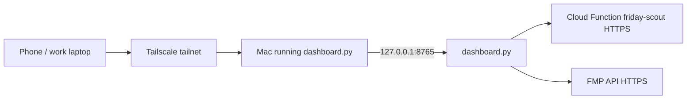
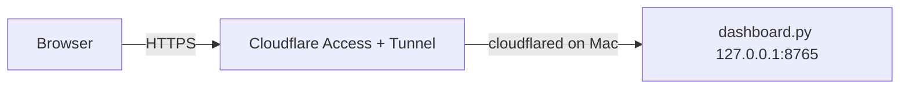

# Scout Sandbox — Remote Access Readiness Plan

**Status:** Planning document (not implemented)  
**Goal:** Run ticker scans during the day from a phone or work laptop **without** exposing the private dashboard to the public internet  
**Constraint:** Do **not** deploy publicly yet  

**Related:** [Infrastructure Hardening Plan](./infrastructure-hardening-plan.md) · [Peer Risk-Adjusted Edge](./peer-risk-adjusted-edge.md)

---

## Table of Contents

1. [Executive summary](#1-executive-summary)
2. [Recommended setup: Tailscale first](#2-recommended-setup-tailscale-first)
3. [What must stay private](#3-what-must-stay-private)
4. [Risks of exposing localhost / the dashboard](#4-risks-of-exposing-localhost--the-dashboard)
5. [Ports and what must be reachable](#5-ports-and-what-must-be-reachable)
6. [Mobile-friendly scan workflow](#6-mobile-friendly-scan-workflow)
7. [Auth and session protection requirements](#7-auth-and-session-protection-requirements)
8. [API keys and `.env` protection](#8-api-keys-and-env-protection)
9. [Fallback: Cloudflare Tunnel (later)](#9-fallback-cloudflare-tunnel-later)
10. [Readiness checklist](#10-readiness-checklist)
11. [What not to do yet](#11-what-not-to-do-yet)

---

## 1. Executive summary

The **gate sandbox** you use for day scans is a single Python process: `scout-gates-sandbox/dashboard.py`. It serves HTML and JSON on **localhost:8765** by default, orchestrates scans via **outbound HTTPS** to the production gate Cloud Function, and reads/writes **local SQLite** (`scout_memory.db`) plus report exports under `exports/reports/`.

For remote access, the right order is:

1. **Tailscale** on the Mac that runs the dashboard (and on phone / work laptop) — private mesh, no public URL.
2. **Keep binding local** (`127.0.0.1`) on the dashboard; reach it through Tailscale’s connection to the Mac, not by opening the machine to the internet.
3. **Add application-layer auth** before treating remote access as “safe enough” (the dashboard currently has **no login**).
4. **Mobile UX** tweaks on `dashboard.html` so “run scan → read pick” works on a phone.
5. **Defer** public hosting, router port-forward, and anonymous tunnel URLs until auth and hardening are in place.

The repo’s **Next.js** app (`npm run dev` → port **3000**) is a **separate** production-style scanner UI. It is **not required** for sandbox scans unless you explicitly want that UI remotely too.

---

## 2. Recommended setup: Tailscale first

### 2.1 Why Tailscale (vs public URL)

| Approach | Exposure | Fit for this sandbox |
|----------|----------|----------------------|
| **Tailscale** | Devices on your tailnet only | **Recommended** — phone/laptop → home Mac, no inbound ports on router |
| Router port-forward + DDNS | Whole internet can probe the port | **Avoid** |
| ngrok / anonymous tunnel | URL can leak; often no real auth | **Avoid until** app auth exists |
| Cloudflare Tunnel + Access | Can be secure with policies | **Good fallback** when you need browser access without VPN (see §9) |

Tailscale gives you a **private IP** for the Mac (e.g. `100.x.y.z`) while `dashboard.py` stays on `127.0.0.1:8765` on that Mac.

### 2.2 Target topology



### 2.3 Steps (operator runbook — planning only)

1. **Install Tailscale** on the Mac that will run scans (always-on or “on when trading”).
2. **Install Tailscale** on iPhone and work laptop; sign in to the **same tailnet**.
3. **Enable MagicDNS** (optional but helpful): use `http://<mac-hostname>:8765` instead of memorizing `100.x` addresses.
4. On the Mac, start the dashboard as today:
   ```bash
   cd scout-gates-sandbox
   python3 dashboard.py
   ```
   Default: `http://127.0.0.1:8765` (see §5).
5. From phone/laptop on Tailscale, open `http://<mac-tailscale-ip>:8765` **only after** §7 auth is implemented — until then, restrict tailnet membership to trusted devices only.
6. **Do not** change `--host` to `0.0.0.0` for “convenience” unless you also add firewall rules **and** app auth (see §4, §7).

### 2.4 Tailscale hardening (network layer)

- Use **tailnet ACLs** so only your user/devices can reach the Mac on port `8765`.
- Prefer **device approval** for new nodes.
- On the Mac, optional **macOS firewall**: allow `8765` only from Tailscale interface (`utun*`), not from the public LAN if the machine is multi-homed.
- **SSH / file sharing** on the same Mac should not be opened to the world; Tailscale is for reaching the dashboard, not exposing the whole disk.

### 2.5 When the Mac is asleep or away

- Scans only work while `dashboard.py` is running on that Mac.
- Options later (out of scope for “no public deploy”): always-on Mac mini, launchd keep-alive, or a **private** remote VM — still behind Tailscale, not on the public web.

---

## 3. What must stay private

Treat these as **confidential operator assets**, not a public SaaS:

| Asset | Location | Why private |
|-------|----------|-------------|
| **Dashboard HTTP API** | `dashboard.py` routes (`/api/run`, `/api/memory/*`, `/api/control/*`, `/api/reports/*`) | No auth today; full read/write to sandbox behavior |
| **Scan history & picks** | `scout-gates-sandbox/scout_memory.db` | Tickers, scores, gate outcomes, recommendations, outcome P&amp;L |
| **Research Memory UI data** | Same DB + `/api/memory/*` | Filters, exports, audit logs |
| **Control panel actions** | `/api/control/*` POSTs | Backfills, rebuilds, test records — destructive / expensive |
| **Environment secrets** | `.env`, `.env.local`, `scout-gates-sandbox/.env` | FMP API keys; optional gate URL overrides |
| **Generated reports** | `exports/reports/*.pdf`, `.report-registry.db` | Full scan breakdowns; downloadable via `/api/reports/download/{file}` |
| **Gate API usage** | Outbound to `friday-scout` Cloud Function | Abusable if someone can trigger unlimited `/api/run` through your dashboard |
| **FMP quota** | Triggered by scans (EI, options) and `/api/memory/update-outcomes` | Costs and rate limits tied to your key |

**OK to remain “public” in the sense of Google Cloud:** the **read-only gate endpoint** (`SCOUT_GATE_API_URL` / default Cloud Function URL) is already used by the production Next.js app. Your **dashboard** is the sensitive part because it aggregates history, keys, and operator controls.

---

## 4. Risks of exposing localhost / the dashboard

### 4.1 Binding `0.0.0.0` or port-forwarding without auth

`dashboard.py` defaults to `--host 127.0.0.1`. If you bind to **all interfaces** or forward the port on your router:

- Anyone who can reach the port can **POST `/api/run`** and burn gate/FMP quota.
- They can **GET `/api/memory/history`** and exfiltrate scan history.
- They can **POST `/api/memory/update-outcomes`** and drive FMP usage.
- They can **POST control rebuilds** and corrupt or overload SQLite analytics paths.
- They can **download PDFs** from `/api/reports/download/` if filenames are guessed or listed via `/api/reports/list`.

There is **no** session, API key, or CSRF protection in the current handler.

### 4.2 “Localhost” is not a security boundary on a shared machine

On a Mac, `127.0.0.1` only blocks **remote** attackers. Malware or another local user profile on the same box can still hit the port. Tailscale + auth addresses **remote** access; FileVault and a single operator account address **local** sharing.

### 4.3 Tunnel URLs that leak

Publishing `http://127.0.0.1:8765` via a public tunnel (ngrok free tier, misconfigured Cloudflare Tunnel) creates a **durable URL** that may be indexed, forwarded, or scanned by bots. Treat tunnel hostnames like passwords.

### 4.4 Concurrent remote + local use

`ThreadingHTTPServer` + SQLite writes: multiple simultaneous scans/saves can stress the DB. Remote phone + local desktop both saving is an **operational** risk (locks, slow writes), not just a secrecy risk.

### 4.5 Logging and screenshots

`dashboard.py` logs request paths and memory query debug to stdout. Remote access increases the chance of **sensitive tickers** in logs or support screenshots — rotate/redact if sharing logs.

---

## 5. Ports and what must be reachable

### 5.1 Port map (this repo)

| Service | Default port | Bind | Required for sandbox day scans? |
|---------|--------------|------|----------------------------------|
| **`dashboard.py`** | **8765** | `127.0.0.1` (`--host`, `--port`) | **Yes** — UI + `/api/run` + memory + reports |
| **Next.js** (`npm run dev`) | **3000** | dev server default | **No** for sandbox — separate prod-style UI |
| **Next.js** (`npm start`) | **3000** | production start | **No** for sandbox |
| **Cloud Function gate API** | **443** (HTTPS) | Google-hosted | **Outbound** from Mac — not a port you open |
| **FMP APIs** | **443** (HTTPS) | FMP-hosted | **Outbound** when scans/options/outcomes run |
| **Chrome headless** (PDF export) | n/a | local subprocess | Invoked by report worker on Mac; not reachable remotely |

### 5.2 Do `dashboard.py` and Next.js both need to be reachable?

**For running sandbox scans from your phone:** **only `dashboard.py` (8765)** on the Mac that holds `scout_memory.db`.

| Workflow | Reach remotely |
|----------|----------------|
| Gate sandbox scan, save results, research memory, control panel, PDF export | **`dashboard.py:8765`** |
| Marketing / legacy Next scanner calling Cloud Function directly | **Next.js:3000** (optional; different app, no local SQLite) |

If both run on the same Mac behind Tailscale, you would expose **two** ports — only do that if you need both UIs; otherwise keep remote access to **8765** alone.

### 5.3 Tailscale access pattern

- Mac runs: `python3 dashboard.py` → listens `127.0.0.1:8765`.
- **Option A (simplest):** Tailscale Serve/Funnel **not** used; SSH port-forward over Tailscale (`ssh -L 8765:127.0.0.1:8765 mac`) from laptop — then browse `http://127.0.0.1:8765` on the client.
- **Option B:** Tailscale **Serve** on the Mac to proxy `https://<machine>.<tailnet>.ts.net` → `127.0.0.1:8765` (still private to tailnet; HTTPS at edge of Serve).
- **Option C (later):** bind dashboard to Tailscale IP only — requires code/config change; prefer A or B first.

Outbound internet from the Mac must remain allowed so `/api/run` can call the gate function and FMP.

---

## 6. Mobile-friendly scan workflow

`dashboard.html` already includes `viewport` meta and responsive layout basics. For **day scans from a phone**, prioritize the gate sandbox page over `research.html` / `control.html` (wide tables, rebuild actions).

### 6.1 Minimum UX (P0 mobile)

| Item | Rationale |
|------|-----------|
| **Sticky “Run scan” bar** | Thumb reach; visible while scrolling results |
| **Larger tap targets** | Buttons ≥ 44px; spacing between destructive actions |
| **Single-column results** | Avoid horizontal scroll on pick cards and gate grid |
| **Short default ticker input** | Paste-friendly; remember last universe in `sessionStorage` |
| **Clear run status** | Spinner + elapsed time; `/api/run` can take tens of seconds (sequential tickers) |
| **Defer heavy pages** | Link Research / Control; don’t load full history on dashboard home |

### 6.2 Nice-to-have (P1 mobile)

- **“Scan only” route** — lightweight HTML page: tickers, pick mode, run, final pick summary (no PDF batch, no control).
- **Reduce font sizes on gate matrix** — collapse to “passed / failed count” with expand.
- **Safe area insets** for iPhone notch (`env(safe-area-inset-*)`).
- **Offline banner** when Tailscale disconnected.

### 6.3 What not to optimize on mobile first

- Full Research Memory filters and CSV export
- Control panel backfills / gate-alpha rebuilds
- Batch PDF export (Chrome on server Mac; download on phone is fine)

### 6.4 Performance expectations on cellular

Each `/api/run` triggers **sequential** gate HTTP calls per ticker (see infrastructure plan). Prefer **smaller universes** from phone; avoid 15+ tickers on a slow connection.

---

## 7. Auth and session protection requirements

**Current state:** `DashboardHandler` has **no authentication** on any route.

Before relying on Tailscale alone for “work laptop” access, implement **application-layer** controls:

### 7.1 Minimum bar (required before non-personal devices)

| Control | Recommendation |
|---------|----------------|
| **Authentication** | HTTP Basic, static bearer token in `Authorization` header, or signed session cookie after login |
| **Secret storage** | `SCOUT_DASHBOARD_TOKEN` or `SCOUT_DASHBOARD_PASSWORD` in `.env` — never in HTML/JS |
| **Enforcement** | Middleware wrapper: reject unauthenticated requests to **all** `/api/*` and HTML pages except optional `/health` |
| **HTTPS to browser** | Use Tailscale Serve HTTPS or SSH `-L`; avoid sending tokens over cleartext on untrusted Wi‑Fi |
| **Session expiry** | Sliding timeout (e.g. 8–12h) for cookie sessions; re-login on tailnet device loss |
| **Rate limiting** | Cap `/api/run` per IP/session (e.g. 10/min) to limit abuse if token leaks |

### 7.2 Stronger bar (recommended for work laptop on corporate network)

- **Separate token** per device class (phone vs laptop) stored in password manager.
- **Disable or ACL-protect** `/api/control/*` POSTs for mobile sessions.
- **Audit log** of authenticated scan runs (timestamp, tickers, tailnet node) — append-only file or SQLite table.
- **CSRF** tokens for cookie-based POSTs if using session cookies from browser.

### 7.3 Tailscale is not a substitute for app auth

Tailscale proves **device membership**, not **application intent**. Anyone on your tailnet (compromised laptop, shared test device) could use the dashboard unless app auth exists.

### 7.4 Implementation sketch (future PR)

1. `load_env()` reads `SCOUT_DASHBOARD_AUTH_REQUIRED=1` and `SCOUT_DASHBOARD_TOKEN`.
2. `DashboardHandler` checks `Authorization: Bearer <token>` or session cookie on every request.
3. `dashboard.html` prompts once, stores token in `sessionStorage`, sends on `fetch()`.
4. Document token rotation in this file.

---

## 8. API keys and `.env` protection

### 8.1 Where secrets live

Loaded by `run_gates.load_env()` from (first match wins per key):

- Repo root `.env` / `.env.local`
- `scout-gates-sandbox/.env`

**Common variables:**

| Variable | Purpose |
|----------|---------|
| `FMP_API_KEY`, `FINANCIAL_MODELING_PREP_API_KEY`, `NEXT_PUBLIC_FMP_API_KEY` | FMP prices, earnings, options |
| `SCOUT_GATE_API_URL`, `SCOUT_API_URL` | Gate Cloud Function base URL |
| `SCOUT_REPORTS_DIR`, `SCOUT_REPORTS_ASYNC` | PDF export paths / async default |
| *(planned)* `SCOUT_DASHBOARD_TOKEN` | Dashboard auth |

`.gitignore` already excludes `.env` and `.env.local` — **never commit** keys.

### 8.2 Rules for remote access

1. **Secrets stay server-side** — only `dashboard.py` reads `.env`; browser never receives FMP keys.
2. **Do not** set `NEXT_PUBLIC_*` FMP keys for the sandbox unless you accept client exposure (Next.js only; not needed for `dashboard.html`).
3. **Rotate FMP key** if a tunnel URL or token leak is suspected; watch FMP dashboard for anomalous usage.
4. **Separate keys** (optional): sandbox FMP key with lower quota vs production.
5. **File permissions** on Mac: `chmod 600 scout-gates-sandbox/.env`; exclude from Time Machine shares / cloud sync folders.
6. **Backups** of `scout_memory.db` encrypt at rest (FileVault, encrypted zip) — contains trading history.

### 8.3 Gate Cloud Function URL

Default in code: `https://us-central1-scout-493918.cloudfunctions.net/friday-scout`. Overriding via env is fine; **do not** embed alternate URLs in client-side Next.js for sandbox workflows.

---

## 9. Fallback: Cloudflare Tunnel (later)

Use when you need **browser access without installing Tailscale** (e.g. one-off demo on a locked-down work PC) — still **not** “public internet anonymous.”

### 9.1 Pattern



1. Install `cloudflared` on the Mac; create a tunnel to `http://127.0.0.1:8765`.
2. Put the hostname behind **Cloudflare Access** (Google Workspace, OTP, or service token).
3. Keep **dashboard app auth** (§7) as defense in depth.
4. **Do not** use “Public Hostname” without Access policies.

### 9.2 Tailscale vs Cloudflare Tunnel

| | Tailscale | Cloudflare Tunnel + Access |
|--|-----------|----------------------------|
| Client install | Tailscale app | None (browser only) |
| Exposure | Tailnet only | Cloudflare edge; policy-gated |
| Ops complexity | Low for personal | Medium (DNS, Access rules) |
| Best for | Phone + laptop daily use | Occasional external browser |

### 9.3 Tunnel-specific risks

- Misconfigured **bypass Access** rule exposes the dashboard globally.
- Tunnel token on disk (`~/.cloudflared/`) is high value — protect like `.env`.

---

## 10. Readiness checklist

Use this before calling remote access “ready”:

### Network

- [ ] Tailscale installed on Mac, phone, and work laptop (same tailnet)
- [ ] Tailnet ACL restricts who can reach Mac port `8765`
- [ ] Dashboard still binds `127.0.0.1` unless deliberately using Serve with auth
- [ ] No router port-forward to 8765 / 3000

### Application security

- [ ] `SCOUT_DASHBOARD_AUTH_REQUIRED` + token or session login implemented
- [ ] All `/api/*` routes require auth
- [ ] Control POST routes disabled or extra-protected for mobile tokens
- [ ] Rate limit on `/api/run`

### Secrets & data

- [ ] `.env` not in git; permissions `600`
- [ ] FMP usage monitored
- [ ] `scout_memory.db` backup strategy defined

### Mobile UX

- [ ] Run scan + view final pick usable on iPhone Safari
- [ ] Destructive control actions not prominent on mobile

### Operations

- [ ] Documented how to start/stop `dashboard.py` on the Mac
- [ ] PDF export works when Chrome headless present on Mac (phone downloads PDF via authenticated GET)

### Explicitly deferred

- [ ] Public deploy of dashboard or Next.js
- [ ] Cloudflare Tunnel without Access
- [ ] ngrok anonymous URLs

---

## 11. What not to do yet

| Do not | Why |
|--------|-----|
| **Publish dashboard to the public internet** | No auth; leaks scans and operator controls |
| **Port-forward 8765 on home router** | Bot scans; same as public exposure |
| **Run `dashboard.py --host 0.0.0.0` without firewall + auth** | LAN/VPN-wide open API |
| **Share ngrok/trycloudflare links** in Slack/email | URL leakage = full dashboard access |
| **Commit `.env` or paste keys into HTML** | Irreversible secret exposure |
| **Expose `/control` to untrusted devices** | Rebuild/backfill endpoints are high impact |
| **Sync `scout_memory.db` to public cloud unencrypted** | PII/trading record exposure |
| **Rely on “security through obscurity”** | `/api/reports/list`, memory export CSV are discoverable |
| **Require Next.js for sandbox scans** | Extra surface (3000) without sandbox DB/history |
| **Implement P1 peer score adjustment before auth** | Increases impact of unauthorized `/api/run` |

---

## Appendix A — Quick reference commands

```bash
# Start sandbox dashboard (default 127.0.0.1:8765)
cd scout-gates-sandbox
python3 dashboard.py

# Custom port (still prefer loopback)
python3 dashboard.py --port 8765 --host 127.0.0.1 --no-open

# Next.js (optional, not needed for sandbox scans)
npm run dev   # http://localhost:3000
```

## Appendix B — Sensitive API routes (lock down first)

| Route | Method | Risk if exposed |
|-------|--------|-----------------|
| `/api/run` | POST | Arbitrary gate scans, FMP side effects |
| `/api/run/save` | POST | Write scan history |
| `/api/memory/update-outcomes` | POST | FMP bulk refresh |
| `/api/memory/export.csv` | GET | Data exfiltration |
| `/api/control/backfill` | POST | Heavy DB mutation |
| `/api/control/gate-alpha` | POST | Rebuild analytics |
| `/api/reports/download/*` | GET | PDF exfiltration |

---

*Last updated: planning draft aligned with `scout-gates-sandbox/dashboard.py` defaults (`127.0.0.1:8765`) and repo layout.*
