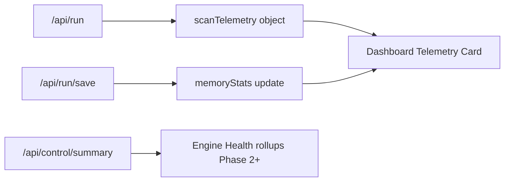

# Horizon-1 — Scan Telemetry / Engine Health Plan

**Status:** Planning document (not implemented)  
**Goal:** Add an observability layer that explains each scan’s operational behavior without altering pick quality or engine authority  
**Constraint:** Do **not** change Horizon-1 scoring, gates, rankings, Stable Signal logic, explainability logic, memory ingestion rules, or winner/pick behavior  

**Related:** [Structured Universe Expansion](./structured-universe-expansion-plan.md) · [Stable Signal State v1](./stable-signal-state-v1.md) · [Infrastructure Hardening](./infrastructure-hardening-plan.md)

---

## Table of Contents

1. [Telemetry goals](#1-telemetry-goals)
2. [Observability philosophy](#2-observability-philosophy)
3. [Compact telemetry card (target UI)](#3-compact-telemetry-card-target-ui)
4. [Available metrics today](#4-available-metrics-today)
5. [Future instrumentation points](#5-future-instrumentation-points)
6. [Placeholders vs real metrics](#6-placeholders-vs-real-metrics)
7. [requestContext relationship](#7-requestcontext-relationship)
8. [UI placement strategy](#8-ui-placement-strategy)
9. [Performance protections](#9-performance-protections)
10. [Warning flags (planned)](#10-warning-flags-planned)
11. [Phased rollout](#11-phased-rollout)
12. [Non-goals and forbidden behaviors](#12-non-goals-and-forbidden-behaviors)
13. [Future integrations deferred beyond v1](#13-future-integrations-deferred-beyond-v1)
14. [Module boundaries](#14-module-boundaries)
15. [What not to do yet](#15-what-not-to-do-yet)

---

## 1. Telemetry goals

Horizon-1 returns rich **pick and explain** data but thin **run and health** data. After `/api/run`, operators see a text status line and must infer failures from `errors[]` or raw JSON.

Scan Telemetry answers operational questions:

| Question | Telemetry answer |
|----------|-------------------|
| Did the scan finish cleanly? | `ok`, warning flags, API fail count |
| How long did it take? | Total runtime, avg per-ticker runtime |
| What was attempted vs completed? | `candidates` vs `results` |
| How selective were the gates? | Passed count, rejected count, pass rate |
| What context was the run under? | Preset, purpose, storage mode, universe mode |
| Was memory touched? | Memory write count, saved flag |
| Where did time go? | Gate API loop vs post-process (future split) |

Telemetry is **descriptive metadata**. It must never feed back into ranking, gate pass/fail, Stable Signal layers, explainability builders, or memory eligibility.

---

## 2. Observability philosophy

### 2.1 Core beliefs

| Belief | Implication |
|--------|-------------|
| **Measure, don’t act** | Telemetry observes; it does not branch scoring or pick logic |
| **Post-hoc aggregation** | Timings collected after each step completes — no inline blocking |
| **Honest placeholders** | Unknown metrics show `—` or “Not instrumented” — never fabricated |
| **Client + server layers** | UI can derive some fields immediately; server is source of truth for runtime |
| **Warnings are display-only** | Flags inform the operator; they do not auto-abort or override storage mode |
| **Backward compatible** | `scanTelemetry` is an optional additive field on scan responses |
| **Separation from Tier 1** | Cloud Function `scout_score` and 14-gate semantics remain frozen |

### 2.2 What telemetry is not

- Not a new scoring or ranking signal  
- Not a gate intelligence input  
- Not a memory write trigger  
- Not a substitute for outcome analytics (WIN/LOSS/returns)  
- Not production APM (Datadog, Sentry, etc.) in v1  

### 2.3 Relationship to Engine Health

**Scan Telemetry** = per-run operational snapshot (one scan).  
**Engine Health** = aggregate sandbox health over time (control panel, DB counts, refresh timings, anomaly hints).

v1 focuses on the **per-scan telemetry card** on the dashboard. Engine Health rollups are Phase 2+.



---

## 3. Compact telemetry card (target UI)

Planned card fields:

| Field | Example |
|-------|---------|
| Scan runtime | `2m 14s` |
| Tickers processed | `10 / 10` |
| Passed count | `3` |
| Rejected count | `7` |
| Pass rate | `30%` |
| Universe preset | `Semiconductors` |
| Scan purpose | `cohort_baseline` |
| Storage mode | `Preview Only` |
| Memory writes | `0` |
| API call count | `10 ok · 0 fail` |
| Failed API calls | `2` (with ticker list in tooltip) |
| Avg ticker runtime | `12.4s` |
| Warning flags | `Partial API failures`, `No gate passers` |

Layout sketch:

```
┌─ Scan Telemetry ─────────────────────────────────────────────┐
│ Runtime          2m 14s          Tickers         10 / 10       │
│ Passed           3               Rejected       7              │
│ Pass rate        30%             Avg ticker     12.4s          │
│ Preset           Semiconductors  Purpose        cohort_baseline│
│ Storage          Preview Only    Memory writes  0              │
│ API calls        10 ok · 0 fail  Endpoint       friday-scout   │
│ ⚠ Partial API failures (2)  ⚠ No gate passers (gate_runner)    │
└──────────────────────────────────────────────────────────────┘
```

---

## 4. Available metrics today

### 4.1 From `/api/run` response (`build_run_payload`)

| Metric | Source | Notes |
|--------|--------|-------|
| Tickers requested | `candidates.length` | Full submitted universe |
| Tickers processed | `results.length` | Successful gate API responses |
| Passed count | `results` where `passedAllGates` | Derivable client- or server-side |
| Rejected count | `rejected.length` | Excludes winner; document clearly |
| Pass rate | `passed / results.length` | Undefined if zero results |
| Failed tickers | `errors[]` | One string per failure |
| API successes | `results.length` | Implicit |
| API attempts | `candidates.length` | Implicit |
| Failed API count | `len(errors)` or `candidates - results` | Should align 1:1 per ticker |
| Endpoint | `apiUrl` | Cloud Function URL |
| Run start time | `runTimestamp` | ISO — **not** duration |
| Pick mode | `pickMode` | Operational context |
| Universe mode | `universeMode` | `custom` \| `fallback` |
| Timeout config | `timeout` | Request setting, not observed latency |
| Scan ok | `ok` | Boolean |
| Memory saved flag | `savedToMemory` | Default `false` |
| Memory run id | `memoryRunId` | After save |

**Gap:** Scan execution has **no** `timings` block today (unlike memory summary loads in `build_memory_summary_payload`).

### 4.2 From `/api/run/save` response

| Metric | Source |
|--------|--------|
| Recommendations written | `recommendationsSaved` |
| Already saved | `alreadySaved` |
| Memory run id | `memoryRunId` |

### 4.3 From dashboard client (UI-only today)

| Metric | Source |
|--------|--------|
| Universe preset label | `#universe-preset` + `UNIVERSE_PRESETS` |
| Scan purpose | Preset metadata |
| Visual tags | Preset metadata |
| Storage mode | `#storage-mode` — **not** in scan payload |
| Client wall runtime | `performance.now()` around fetch — approximate |

### 4.4 From control / memory (aggregate, not per-scan v1)

| Metric | Source |
|--------|--------|
| DB row counts | `get_control_summary()` |
| Outcome refresh timings | `performance_tracker` → `timings` |
| Research summary timings | `build_memory_summary_payload()` → `timings` |

---

## 5. Future instrumentation points

Minimal additive object on scan payload — computed **after** the scan loop, **no extra network calls**.

### 5.1 Proposed `scanTelemetry` shape

```json
{
  "scanTelemetry": {
    "startedAtUtc": "2026-05-19T12:00:00+00:00",
    "completedAtUtc": "2026-05-19T12:02:14+00:00",
    "totalRuntimeMs": 134200,
    "tickerStats": {
      "requested": 10,
      "succeeded": 10,
      "failed": 0,
      "passedAllGates": 3,
      "passRatePct": 30.0
    },
    "apiStats": {
      "gateApiCallsAttempted": 10,
      "gateApiCallsSucceeded": 10,
      "gateApiCallsFailed": 0,
      "failedTickers": []
    },
    "timingStats": {
      "avgTickerRuntimeMs": 12400,
      "maxTickerRuntimeMs": 22100,
      "minTickerRuntimeMs": 8100,
      "postProcessRuntimeMs": 4200
    },
    "requestContext": {
      "storageMode": "preview",
      "universeMode": "custom",
      "universePresetId": "semiconductors",
      "scanPurpose": "cohort_baseline",
      "pickMode": "gate_runner",
      "timeoutSec": 25
    },
    "memoryStats": {
      "writes": 0,
      "saved": false,
      "memoryRunId": null
    },
    "warnings": ["no_gate_passers"]
  }
}
```

### 5.2 Instrumentation map

| Point | Location | Phase |
|-------|----------|-------|
| Total runtime | `build_run_payload` `perf_counter` wrap | 1 |
| Per-ticker duration | Loop around `fetch_gate_result` | 1 |
| Post-process split | After loop vs explain/option/serialize | 1 |
| Option-picker call count | `choose_option_contract` invocations | 2 |
| Warning derivation | Pure `build_scan_warnings()` | 1 |
| requestContext echo | Pass-through from request body | 2 |
| Memory stats merge | After `/api/run/save` on client | 0–1 |
| Persist on `scan_runs` | `save_scan_result` extension | 3 |

**Reuse:** `log_timing` / `log_memory_load` pattern from `memory_store.py` — apply to scan execution without changing scan semantics.

### 5.3 Data flow (planned)

```mermaid
sequenceDiagram
  participant UI as dashboard.html
  participant API as /api/run
  participant Loop as build_run_payload
  participant CF as friday-scout CF

  UI->>API: tickers, modes, timeout, requestContext
  Loop->>Loop: telemetry.startedAtUtc
  loop each ticker
    Loop->>CF: fetch_gate_result
    Loop->>Loop: record tickerRuntimeMs
  end
  Loop->>Loop: serialize, explain (postProcessMs)
  Loop->>Loop: build scanTelemetry
  API-->>UI: payload + scanTelemetry
  UI->>UI: merge UI-only preset if needed
  UI->>UI: render Telemetry Card
  opt Save Results
    UI->>API: /api/run/save
    API-->>UI: recommendationsSaved
    UI->>UI: update memoryStats on card
  end
```

---

## 6. Placeholders vs real metrics

| Metric | v1 status | Display when missing |
|--------|-----------|----------------------|
| Tickers requested / processed | **Real** (derivable now) | Always shown |
| Passed / rejected / pass rate | **Real** (derivable now) | Always shown |
| Failed API count | **Real** (`errors.length`) | Always shown |
| Scan runtime (server) | **Future** Phase 1 | Client estimate in Phase 0; label clearly |
| Avg ticker runtime | **Future** Phase 1 | `—` until instrumented |
| Max/min ticker runtime | **Future** Phase 1 | Hidden or `—` |
| Post-process runtime | **Future** Phase 1 | `—` |
| Universe preset / purpose | **Partial** (client UI only) | From preset panel; echo in Phase 2 |
| Storage mode | **Partial** (client request only) | From form state |
| Memory writes | **Real** after save | `0` until save completes |
| Per-gate CF latency | **Placeholder** | “Not instrumented” |
| HTTP status histogram | **Placeholder** | “Not instrumented” |
| Retry count | **Placeholder** | “Not instrumented” |
| FMP / option API timings | **Placeholder** | “Not instrumented” |
| Cross-scan runtime trends | **Placeholder** Phase 4 | Control panel only |
| Engine version mismatch | **Placeholder** | Control summary reference |

**Rule:** Never synthesize averages from UI estimates and present them as server-measured.

---

## 7. requestContext relationship

`requestContext` is the **operational intent** of a scan — metadata that describes how the run was configured, not what the engine decided.

### 7.1 Purpose

| Role | Description |
|------|-------------|
| **Echo** | Copy safe request fields into `scanTelemetry` for audit replay |
| **Join key** | Link telemetry to future universe preset resolver and memory tags |
| **UI alignment** | Same fields shown on preset panel and telemetry card |
| **Not scoring input** | Never passed to `scout_score`, gates, or `choose_final_pick` |

### 7.2 Fields (planned)

| Field | Source today | Phase |
|-------|--------------|-------|
| `storageMode` | Dashboard `#storage-mode` | Echo in Phase 2 |
| `universeMode` | Request + payload | Available now |
| `universePresetId` | Dashboard `#universe-preset` | Client-only Phase 0; echo Phase 2 |
| `scanPurpose` | `UNIVERSE_PRESETS` metadata | Client-only Phase 0; echo Phase 2 |
| `pickMode` | Request + payload | Available now |
| `timeoutSec` | Request + payload | Available now |

### 7.3 Merge rules

1. **Server authoritative** for timing and API stats.  
2. **Client fills gaps** for UI-only preset fields until backend resolver ships.  
3. When both exist, server `requestContext` wins; client shows “merged” badge only if values differ (debug hint).  
4. `requestContext` is stored on `scan_runs` at save time (Phase 3) — optional, nullable columns aligned with [Structured Universe Expansion](./structured-universe-expansion-plan.md).

### 7.4 Distinction from explainability context

| Object | Purpose |
|--------|---------|
| `requestContext` | Operator config (preset, storage, timeout) |
| `ScanExplainContext` / Stable Signal | Gate and layer explainability for picks |
| `universe_snapshot_json` | Post-run universe composition for memory |

These must remain separate. Telemetry does not populate Stable Signal or explainability builders.

---

## 8. UI placement strategy

### 8.1 Phase 0 — Dashboard client-derived card

**Location:** Between `#status` and `#output`, visible after run completes (success or partial).

```
[ status line — errors and summary text ]
[ Scan Telemetry card — collapsible, default expanded ]
[ Final Pick / tables / raw JSON ]
```

**Derivation:** Existing payload + `currentRequest` + client `performance.now()`.

Label runtime as **“Client estimate”** until server `totalRuntimeMs` exists.

### 8.2 Phase 1 — Server-backed card

Same placement; replace estimates with `scanTelemetry` from `/api/run`.

Footer (collapsed): `runTimestamp`, `apiUrl` host, `pickMode`.

### 8.3 Pre-run panel (no duplication)

The **Universe Preset meta** panel (`Tickers`, `Scan purpose`, `Runtime est.`) remains the **pre-run planner**.  
Post-run telemetry card shows **actuals** — do not duplicate both at full size.

### 8.4 Phase 2 — Control panel (`control.html`)

**Engine Health** section: rollup of last N scans (avg runtime, API fail rate, preview vs saved ratio). Requires persisted telemetry on `scan_runs`.

### 8.5 Phase 3 — Research Memory

Read-only telemetry on saved run detail from stored snapshot — not in v1.

### 8.6 Explicitly out of scope for v1 UI

- PDF scoring breakdown header  
- Per-ticker row telemetry in ranked tables  
- Real-time streaming progress bar (future async scan queue)

---

## 9. Performance protections

| Rule | Rationale |
|------|-----------|
| **No extra API calls** | Count only what `/api/run` already performs |
| **Post-loop aggregation** | Timings recorded after each ticker returns |
| **No synchronous SQLite during scan** | Do not write telemetry to DB in `/api/run` v1 |
| **O(n) over tickers only** | Per-ticker timing array length = candidates count |
| **Optional response field** | Old clients ignore missing `scanTelemetry` |
| **Collapsible card** | Reduce layout cost on mobile |
| **Warnings computed in one pass** | Pure function, no I/O |
| **No telemetry-driven retries** | Retries would change behavior and runtime |
| **stderr logging optional** | Mirror `log_memory_load` pattern; off by default in production |

### 9.1 Phase 0 client-only safety

Client-derived telemetry adds **zero** server load. Use `performance.now()` once per run; avoid polling or mutation observers.

### 9.2 Budget reference

Align warning thresholds with universe expansion caps ([Structured Universe Expansion](./structured-universe-expansion-plan.md)):

- `slow_scan`: total runtime > 300s  
- `large_universe`: candidates > 8  
- `timeout_pressure`: any ticker duration > 90% of configured timeout  

---

## 10. Warning flags (planned)

Display-only flags from `build_scan_warnings(telemetry, context)`:

| Flag | Condition | Severity |
|------|-----------|----------|
| `partial_api_failures` | `errors.length > 0` && `results.length > 0` | Warning |
| `all_api_failures` | `results.length === 0` | Error |
| `no_gate_passers` | `passed === 0` && `pickMode === gate_runner` | Info |
| `low_pass_rate` | pass rate < 10% && `results.length >= 5` | Info |
| `large_universe` | `candidates.length > 8` | Info |
| `preview_recommended` | large universe + `storageMode === save_eligible` | Warning |
| `failure_learning_preset` | preset = failure_learning | Info |
| `etf_regime_preset` | preset = etfs | Info |
| `slow_scan` | `totalRuntimeMs > 300000` | Warning |
| `timeout_pressure` | any ticker runtime > `0.9 * timeout` | Warning |
| `memory_saved` | `savedToMemory === true` | Info |

Flags must not trigger auto-abort, storage overrides, or ranking changes.

---

## 11. Phased rollout

### Phase 0 — Client-derived telemetry card

**Deliverables**

- Dashboard card from existing payload + `currentRequest` + client timing  
- Clear “Client estimate” labeling for runtime  
- Warning flags derivable from payload today  

**Backend changes:** None  

**Success criteria:** Operators see pass/fail counts and API errors without opening raw JSON  

---

### Phase 1 — Server `scanTelemetry` on `/api/run`

**Deliverables**

- `perf_counter` wrap in `build_run_payload`  
- Per-ticker timing in scan loop  
- `scanTelemetry` object on successful and partial responses  
- `build_scan_warnings()` pure helper  

**Backend changes:** Additive JSON only — no scoring/gate changes  

**Success criteria:** Server runtime within ±1s of client estimate; avg ticker runtime populated  

---

### Phase 2 — requestContext echo + control rollups

**Deliverables**

- Echo `storageMode`, `universePresetId`, `scanPurpose` from request into `scanTelemetry.requestContext`  
- Control panel Engine Health: last-N scan summary (requires lightweight in-memory ring buffer or DB read)  

**Success criteria:** Preset and purpose on card match saved request after reload  

---

### Phase 3 — Persist telemetry at save

**Deliverables**

- Store `scanTelemetry` JSON on `scan_runs` (or `runtime_budget_json` extension) when `/api/run/save` runs  
- Research Memory run detail shows read-only telemetry  

**Success criteria:** Saved runs replay operational context without client state  

---

### Phase 4 — Trends and anomaly hints

**Deliverables**

- Runtime percentiles vs trailing 30 days  
- API fail rate trend  
- Integration with control panel anomaly monitor (display only)  

**Success criteria:** Slow scans and fail spikes visible before they affect memory quality  

---

## 12. Non-goals and forbidden behaviors

### 12.1 Non-goals (v1)

- Changing Cloud Function or gate evaluation  
- Telemetry-driven universe selection  
- Auto-switching storage mode based on warnings  
- Blocking scans on warning flags  
- Feeding telemetry into gate intelligence, pattern engine, or gate alpha  
- Replacing outcome analytics (WIN/LOSS, forward returns)  
- Full production APM or distributed tracing  

### 12.2 Forbidden behaviors

| Forbidden | Why |
|-----------|-----|
| Use pass rate to adjust `scout_score` or ranking | Contaminates Tier 1 authority |
| Use runtime to skip tickers mid-scan | Changes scan output |
| Use warnings to force Preview Only | Changes operator workflow without consent |
| Fabricate metrics when instrumentation missing | Breaks observability trust |
| Write telemetry to memory tables during `/api/run` | Couples observability to ingestion |
| Send telemetry to external services in v1 | Scope and privacy |
| Merge telemetry into Stable Signal or explainability payloads | Layer boundary violation |

---

## 13. Future integrations deferred beyond v1

| Integration | Deferred to | Notes |
|-------------|-------------|-------|
| Datadog / OpenTelemetry export | Post v1 | Requires auth and sampling policy |
| Horizon-Flow workflow triggers | Separate spec | Not scan telemetry v1 |
| Slack / email alert on `all_api_failures` | Phase 4+ | Notification layer |
| PDF report telemetry section | Optional Phase 3 | Reporting-only |
| Chrome/PDF pipeline timings | Reporting subsystem | Already separate worker |
| Peer scoring / PRAE timing | When PRAE becomes active | Informational only |
| Regime snapshot write telemetry | Universe expansion Phase 2+ | Cohort-specific |
| Async scan job queue progress | Scheduled runs phase | Different UX |
| Cross-environment compare (prod vs sandbox) | Infrastructure phase | Security sensitive |

---

## 14. Module boundaries

| Layer | Telemetry impact |
|-------|------------------|
| Cloud Function `scout_score` | **None** |
| 14 gates pass/fail | **None** |
| `choose_final_pick` / winner | **None** |
| Stable Signal S1 / S2 | **None** |
| Explainability builders | **None** |
| Memory ingestion rules | **None** (optional **record** at save only) |
| `build_run_payload` | **Add** timing + `scanTelemetry` only |
| `dashboard.html` | **Display** card |
| `control.html` | **Aggregate** Phase 2+ |

### Minimal implementation footprint (when Phase 0 begins)

| File | Change size |
|------|-------------|
| `dashboard.html` | Telemetry card render + client derivation |
| `dashboard.py` | Phase 1: timing wrap in `build_run_payload` |
| `run_gates.py` | Phase 1: optional per-call timing return |
| `scan_telemetry.py` (new) | Phase 1: `build_scan_telemetry`, `build_scan_warnings` |
| `memory_store.py` | Phase 3: optional JSON column on save |
| `gates_test.py` | Phase 1: telemetry shape tests |

**Reversible:** omit `scanTelemetry` from response; card falls back to client derivation.

---

## 15. What not to do yet

- Implement `scanTelemetry` or dashboard card  
- Add telemetry-driven retries, caps, or storage overrides  
- Persist telemetry to SQLite during `/api/run`  
- Wire telemetry into ranking, gates, Stable Signal, or memory eligibility  
- Add external monitoring integrations  
- Block or modify scans based on warning flags  

---

*Last updated: 2026-05-19 · Planning only — no sandbox code changes in this document.*
