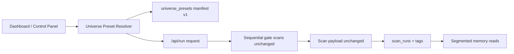

# Horizon-1 — Structured Universe Expansion Plan

**Status:** Planning document (not implemented)  
**Goal:** Expand statistical diversity and memory quality without creating noise or uncontrolled runtime growth  
**Constraint:** Do **not** change Horizon-1 scoring, gates, Stable Signal logic, explainability logic, or winner/pick behavior  

**Related:** [Stable Signal State v1](./stable-signal-state-v1.md) · [Infrastructure Hardening](./infrastructure-hardening-plan.md) · [Remote Access Plan](./remote-access-plan.md)

---

## Table of Contents

1. [Universe philosophy](#1-universe-philosophy)
2. [Preset architecture](#2-preset-architecture)
3. [Ticker cohorts](#3-ticker-cohorts)
4. [Tagging strategy](#4-tagging-strategy)
5. [Runtime protection](#5-runtime-protection)
6. [Memory contamination protections](#6-memory-contamination-protections)
7. [ETF and Failure Learning quarantine logic](#7-etf-and-failure-learning-quarantine-logic)
8. [UI and control panel selection (planned)](#8-ui-and-control-panel-selection-planned)
9. [Phased rollout](#9-phased-rollout)
10. [Future adaptive universe roadmap](#10-future-adaptive-universe-roadmap)
11. [Module boundaries (frozen vs expandable)](#11-module-boundaries-frozen-vs-expandable)
12. [What not to do yet](#12-what-not-to-do-yet)

---

## 1. Universe philosophy

Horizon-1 today resolves universes in one of two ways:

| Mode | Behavior today |
|------|----------------|
| `custom` | Operator types tickers into the dashboard |
| `fallback` | Fixed `DEFAULT_CANDIDATES` list (~15 mega-cap growth names in `run_gates.py`) |

Saved runs persist `universe_mode`, `candidates_json`, and `universe_snapshot_json` on `scan_runs`. That is enough for replay but not enough for **cohort-aware memory** or **controlled diversity**.

### 1.1 Core beliefs

| Belief | Implication |
|--------|-------------|
| **Presets are metadata, not logic** | Universe choice selects tickers and tags runs; it does not alter `scout_score`, gate pass/fail, Stable Signal, explainability, or winner selection |
| **Small by default** | Curated lists of 8–12 names; hard server caps; no market-wide scanning |
| **Purpose-driven scans** | Every run declares *why* it exists (`scanPurpose`) so memory consumers can filter correctly |
| **Preview-first** | New presets default to Preview Only until validated in the control panel |
| **Segmented memory** | Analytics and training reads group by `universeType` + `scanPurpose` + `regimeContext` |
| **Deterministic lists** | Versioned JSON manifests — not live screeners, not dynamic indicator filters |
| **Runtime budget is explicit** | Every run declares ticker count, timeout, and estimated duration before execution |

### 1.2 What diversity means in Horizon-1

Diversity is **not** “scan everything.” It is:

- Sector and beta spread across saved cohorts
- Pass/fail variation for gate intelligence (pass-conditioned metrics)
- Regime context samples (ETF probes) stored separately from stock pick training
- Enough completed outcomes per cohort to compare descriptive stats — never to feed back into live ranking in v1



---

## 2. Preset architecture

### 2.1 Two-axis model

Separate **how tickers are chosen** from **why the scan exists**:

| Axis | Field | Purpose |
|------|-------|---------|
| **Resolution mode** | `universeMode` (existing, extended) | `custom` \| `preset` \| `fallback` |
| **Preset identity** | `universePresetId` (new) | e.g. `momentum_v1` |
| **Cohort class** | `universeType` (new) | Analytics segment key |
| **Scan intent** | `scanPurpose` (new) | Memory consumer filter |
| **Regime label** | `regimeContext` (new) | Human/machine cohort comparison tag (not a new indicator) |

Example resolved preset payload (internal, not scan output):

```json
{
  "universePresetId": "defensive_v1",
  "universeType": "defensive",
  "scanPurpose": "cohort_baseline",
  "regimeContext": "risk_off_probe",
  "presetVersion": "2026.05.1",
  "maxTickers": 10,
  "tickers": ["JNJ", "PG", "KO", "PEP", "WMT", "COST", "UNH", "MRK", "NEE", "SO"]
}
```

### 2.2 Phase 1 preset catalog

| Preset ID | `universeType` | Primary statistical goal | Default `scanPurpose` |
|-----------|----------------|--------------------------|------------------------|
| `momentum_v1` | `momentum` | Trend persistence; COMPASS / MERIDIAN pass diversity | `cohort_baseline` |
| `defensive_v1` | `defensive` | Low-beta behavior; FORTRESS / AEGIS samples in risk-off | `cohort_baseline` |
| `cyclical_v1` | `cyclical` | Sector wind + macro sensitivity | `cohort_baseline` |
| `etf_regime_v1` | `etf_regime` | Market/sector regime context (breadth proxies) | `regime_probe` |
| `volatility_v1` | `volatility` | PULSE / AEGIS edge cases; IV regime samples | `stress_sample` |
| `failure_learning_v1` | `failure_learning` | Gate-failure diversity for intelligence metrics | `gate_intelligence` |

**Failure Learning** is not a pick universe. It exists to enrich pass/fail-conditioned gate stats without polluting winner/outcome cohorts.

### 2.3 Proposed module layout (implementation deferred)

```
scout-gates-sandbox/
  universe_presets/
    manifest.json              # registry, global caps, version
    momentum_v1.json
    defensive_v1.json
    cyclical_v1.json
    etf_regime_v1.json
    volatility_v1.json
    failure_learning_v1.json
  universe_presets.py          # resolve_preset(id) -> tickers + metadata
```

Each preset JSON file includes:

- `id`, `version`, `universeType`, `description`
- `tickers[]` (ordered, deduped)
- `maxTickers`, `recommendedTimeoutSec`
- `defaultScanPurpose`, `defaultRegimeContext`
- `memoryPolicy`: `preview_only` | `save_eligible_after_review`
- `analyticsSegment`: key used in memory filters

Lists change only via manifest version bumps — no runtime screener.

### 2.4 Request shape (additive, planned)

```json
{
  "universeMode": "preset",
  "universePresetId": "momentum_v1",
  "scanPurpose": "cohort_baseline",
  "regimeContext": "neutral",
  "storageMode": "preview",
  "tickers": "",
  "pickMode": "gate_runner",
  "timeout": 25
}
```

`resolve_universe(request)` runs **before** the existing sequential scan loop in `build_run_payload`. The scan loop, Cloud Function calls, and serialization path remain unchanged.

---

## 3. Ticker cohorts

Curated for **liquidity, sector spread, and gate diversity** — not market coverage. Initial v1 target: **10 tickers per preset**.

### 3.1 Momentum (`momentum_v1`)

High trend participation, growth leadership.

`NVDA`, `AMD`, `META`, `NFLX`, `CRM`, `NOW`, `UBER`, `ANET`, `PANW`, `SHOP`

### 3.2 Defensive (`defensive_v1`)

Staples, healthcare, utilities, low-volatility quality.

`JNJ`, `PG`, `KO`, `PEP`, `WMT`, `COST`, `UNH`, `MRK`, `NEE`, `SO`

### 3.3 Cyclical (`cyclical_v1`)

Industrials, materials, discretionary cyclicals.

`CAT`, `DE`, `BA`, `GE`, `FCX`, `NUE`, `HD`, `LOW`, `MAR`, `DAL`

### 3.4 ETF Regime (`etf_regime_v1`)

Regime probes — **`scanPurpose = regime_probe`**, not stock-pick training.

`SPY`, `QQQ`, `IWM`, `DIA`, `XLK`, `XLF`, `XLE`, `XLV`, `HYG`, `TLT`

### 3.5 Volatility (`volatility_v1`)

Event/IV-sensitive names for PULSE / AEGIS sampling.

`TSLA`, `COIN`, `MSTR`, `SMCI`, `PLTR`, `SNOW`, `CRWD`, `DDOG`, `MRNA`, `BIIB`

### 3.6 Failure Learning (`failure_learning_v1`)

Mixed quality / frequent partial gate failure — **preview + isolated analytics only**.

`GME`, `AMC`, `RIVN`, `LCID`, `SNAP`, `LYFT`, `INTC`, `PYPL`, `DIS`, `BA`

### 3.7 Cohort maintenance rules

| Rule | Rationale |
|------|-----------|
| Max 10 names per preset in v1 | Runtime and operator reviewability |
| Review quarterly | Replace illiquid or structurally changed names |
| Bump `presetVersion` on any ticker change | Reproducible memory segments |
| Never auto-expand from scan results | Prevents feedback loops into universe selection (until Phase 3 guardrails) |

---

## 4. Tagging strategy

### 4.1 `scan_runs` (new columns, nullable)

| Column | Type | Example |
|--------|------|---------|
| `universe_type` | TEXT | `momentum` |
| `universe_preset_id` | TEXT | `momentum_v1` |
| `universe_preset_version` | TEXT | `2026.05.1` |
| `scan_purpose` | TEXT | `cohort_baseline` |
| `regime_context` | TEXT | `risk_off_probe` |
| `storage_mode` | TEXT | `preview` |
| `runtime_budget_json` | TEXT | `{"maxTickers":12,"timeoutSec":25,"elapsedMs":142000}` |

Existing columns (`universe_mode`, `pick_mode`, `candidates_json`, `universe_snapshot_json`) remain.

### 4.2 `universe_snapshot_json` (backward-compatible extension)

Add to the existing snapshot object built by `build_universe_snapshot()`:

```json
{
  "universe_type": "momentum",
  "universe_preset_id": "momentum_v1",
  "scan_purpose": "cohort_baseline",
  "regime_context": "neutral",
  "preset_version": "2026.05.1"
}
```

### 4.3 `scan_results` (optional denormalization)

Copy `universe_type`, `scan_purpose`, and `regime_context` onto each recommendation row for fast Research Memory filters without joining `scan_runs`.

### 4.4 Enum registry (single source of truth)

```python
UNIVERSE_TYPES = (
    "momentum",
    "defensive",
    "cyclical",
    "etf_regime",
    "volatility",
    "failure_learning",
    "custom",
)

SCAN_PURPOSES = (
    "cohort_baseline",      # standard stock cohort memory
    "regime_probe",         # ETF / macro context only
    "stress_sample",        # volatility / event stress
    "gate_intelligence",    # failure-learning quarantine
    "manual_research",      # operator ad-hoc custom list
    "validation",           # preset QA before save_eligible promotion
)

REGIME_CONTEXTS = (
    "risk_on",
    "risk_off_probe",
    "neutral",
    "high_vol",
    "earnings_season",
    "unknown",
)
```

### 4.5 Idempotency / dedupe keys

Extend save-once identity from `(runTimestamp, universe_mode, pick_mode)` to include:

`(runTimestamp, universe_preset_id, scan_purpose, pick_mode)`

Allows intentional re-runs with different purpose tags while preventing accidental duplicate cohort writes.

### 4.6 Reporting and UI surfacing (tags only)

When implemented, tags appear on:

- Dashboard results header after a preset run
- Research Memory row filters and detail panels
- PDF/report headers (`universeType`, `scanPurpose`) — reporting metadata only
- Control panel coverage matrix (preset × completed outcomes)

Tags are **context**, not inputs to Stable Signal or explainability builders.

---

## 5. Runtime protection

Current sandbox behavior: sequential `for ticker in candidates` in `build_run_payload`, one Cloud Function call per ticker, per-ticker timeout. Presets must respect that model.

### 5.1 Hard caps (server-enforced)

| Guard | Recommended value |
|-------|-------------------|
| `MAX_TICKERS_PER_RUN` | 12 (global) |
| `MAX_TICKERS_PER_PRESET` | 10 (manifest) |
| `MAX_RUNS_PER_HOUR` | 6 (sandbox operator) |
| `MAX_CONCURRENT_SCANS` | 1 (keep sequential) |
| `MAX_TIMEOUT_SEC` | 90 (existing UI max) |

Reject requests with a clear error when `len(candidates) > MAX_TICKERS_PER_RUN`.

### 5.2 Scan budget estimator (UI, planned)

```
estimatedMs = tickerCount * (timeoutSec * 1000 * 0.6) + 5000 overhead
```

Show a warning when `estimatedMs > 300_000` (5 minutes). Display ticker count and cap on the run button row.

### 5.3 Batching (Phase 2+, deferred)

If a preset ever exceeds the cap:

- Split into batches of 8 tickers
- Each batch = separate `scan_runs` row sharing a `batchGroupId`
- **No merged winner** across batches (avoid synthetic cross-batch ranking)

Phase 1 avoids batching by keeping all presets ≤ 10 tickers.

### 5.4 Async boundaries

| Layer | Phase 1 | Later |
|-------|---------|-------|
| Gate scan execution | Synchronous `/api/run` | Optional background job queue |
| Outcome refresh | Existing performance tracker path | Unchanged |
| PDF export | Existing async report worker | Unchanged |
| Scheduled preset rotation | N/A | Single-flight worker lock (Phase 2) |

### 5.5 Failure isolation

Preserve existing behavior:

- Per-ticker errors collected in `errors[]`
- Abort only when **zero** tickers succeed
- Log preset id + partial completion rate to control summary

---

## 6. Memory contamination protections

### 6.1 Segmentation rules for memory consumers

| Consumer | Default filter |
|----------|----------------|
| Outcome analytics / win rate | `scan_purpose IN ('cohort_baseline', 'manual_research')` AND `storage_mode != 'preview'` |
| Gate intelligence (pass-conditioned) | Include `gate_intelligence`; exclude `etf_regime` unless explicitly flagged |
| Pattern engine / gate alpha | Group by `(universe_type, regime_context)` |
| Winner history / best ticker cards | Exclude `failure_learning` and `regime_probe` |
| Research Memory default view | Show tags; hide `preview` + `failure_learning` unless operator toggles |

### 6.2 Contamination anti-patterns to block

| Anti-pattern | Guard |
|--------------|-------|
| ETF regime probes in stock win-rate denominators | `scan_purpose != regime_probe` on outcome stats |
| Failure Learning saved as training data without confirm | Default `preview_only`; explicit save override + audit log |
| Cross-universe percentile ranks | Ranks stay **within-run only** (existing behavior) |
| Preview scans auto-promoted to training | Require `save_eligible` + manual Save Results |
| Adaptive selection feeding live ranking | Forbidden in all phases of this plan |

### 6.3 Preview vs save policy by preset

| Preset | Default storage | Save eligible when |
|--------|-----------------|-------------------|
| Momentum, Defensive, Cyclical | Preview | Operator selects Save + outcomes refreshed |
| Volatility | Preview | Control health green + ≥ 20 completed outcomes in cohort |
| ETF Regime | Preview | Regime tables only; never stock pick training |
| Failure Learning | Preview | Never auto-save; manual export / gate-intel refresh only |

### 6.4 Interpretability preservation

- Preset name and purpose visible on every saved run
- Control panel **coverage matrix**: preset × completed outcomes × preview vs saved
- Stable Signal layers and explainability unchanged — universe tags do not become layer inputs
- Compare descriptive stats across universes only in control/research views — never in `/api/run` ranking

---

## 7. ETF and Failure Learning quarantine logic

These two presets require **hard quarantine** because they optimize for context and gate-education, not pick quality.

### 7.1 ETF Regime (`etf_regime_v1`)

| Attribute | Value |
|-----------|-------|
| `scanPurpose` | `regime_probe` |
| `universeType` | `etf_regime` |
| Winner/pick | Still computed by existing logic for observability — **excluded from training filters** |
| Memory writes | Allowed to `regime_snapshots` / tagged probe tables; excluded from stock outcome leaderboards |
| Gate intelligence | Excluded by default (ETF gate semantics differ from single-name equity cohorts) |
| Save policy | Preview default; if saved, tagged `regime_probe` only |

**Quarantine filter (SQL pseudocode):**

```sql
WHERE scan_purpose != 'regime_probe'
  AND universe_type != 'etf_regime'
```

Apply to: outcome win rate, best/worst ticker, directional accuracy aggregates, pattern training cohorts.

### 7.2 Failure Learning (`failure_learning_v1`)

| Attribute | Value |
|-----------|-------|
| `scanPurpose` | `gate_intelligence` |
| `universeType` | `failure_learning` |
| Purpose | Enrich pass/fail-conditioned gate metrics; study failure modes |
| Winner/pick | Not meaningful for training — **never promote to saved pick history** |
| Memory writes | Preview only; optional manual save triggers gate-intel refresh only |
| Outcome analytics | Excluded from win-rate and return leaderboards |
| PDF export | Allowed for operator review |

**Quarantine filter (SQL pseudocode):**

```sql
WHERE scan_purpose != 'gate_intelligence'
  AND universe_type != 'failure_learning'
```

Apply to: outcome analytics, most/least predictive gate cards (when derived from outcome cohorts), pattern engine primary cohorts.

### 7.3 Combined quarantine matrix

| Dataset | Momentum / Defensive / Cyclical / Volatility | ETF Regime | Failure Learning |
|---------|-----------------------------------------------|------------|------------------|
| Outcome win rate | ✅ | ❌ | ❌ |
| Gate intelligence (pass-conditioned) | ✅ | ❌ (default) | ✅ |
| Regime snapshots | ✅ | ✅ | ⚠️ (low priority) |
| Winner history | ✅ | ❌ | ❌ |
| Pattern / gate alpha primary | ✅ | ⚠️ (segmented) | ❌ |
| Preview dashboard results | ✅ | ✅ | ✅ |

### 7.4 Operator override (audited)

If an operator explicitly saves a quarantined run:

- Require confirmation dialog naming the quarantine class
- Write `institutional_audit_log` event: `universe_quarantine_override`
- Still apply segment filters unless operator enables "Include quarantined cohorts" in Research Memory

---

## 8. UI and control panel selection (planned)

### 8.1 Dashboard (operator scan)

Two-step selector replacing the binary universe dropdown:

```
Universe Source
  ○ Custom tickers (existing textarea)
  ○ Structured preset

Structured Preset          [ Momentum v1        ▼ ]
Scan Purpose               [ Cohort baseline    ▼ ]  (auto-filled, editable)
Regime Context (optional)  [ —                  ▼ ]
Storage Mode               [ Preview Only       ▼ ]

Estimated: 10 tickers · ~3–5 min · cap 12
[ Run Gates ]
```

- Preset selection fills a read-only ticker preview
- `fallback` becomes "Legacy default list" under Advanced
- Custom tickers remain for ad-hoc work

### 8.2 Control panel (`control.html`)

**Universe Presets** card:

| Display | Source |
|---------|--------|
| Active preset catalog version | `manifest.json` |
| Last run per `universeType` | `scan_runs` grouped query |
| Saved vs preview counts by preset | memory stats |
| Recommended next preset | lowest `completed_outcomes` coverage |

Phase 1 actions: view definitions (read-only), copy tickers, deep-link to dashboard (`?preset=momentum_v1`).

---

## 9. Phased rollout

### Phase 1 — Manual presets (target: 4–6 weeks)

**Deliverables**

- `universe_presets/` manifest + six preset JSON files
- `resolve_universe(request)` hook in sandbox only
- Dashboard preset selector + control panel read-only catalog
- DB columns on `scan_runs` + snapshot extension
- Research Memory filters by `universeType` / `scanPurpose`
- Preview default for all new presets

**Success criteria**

- ≥ 3 presets each with ≥ 15 saved, outcome-completed rows
- Gate intelligence shows spread across universe types (pass-conditioned)
- No change in winner/score distribution vs same tickers under `custom`

**Not in Phase 1:** scheduling, adaptive selection, new indicators, Horizon-Flow

---

### Phase 2 — Scheduled rotations (target: 6–8 weeks)

**Deliverables**

- Cron/worker rotates through preset queue (e.g. one preset per weekday)
- Rotation policy file: `{ "monday": "momentum_v1", "tuesday": "defensive_v1", ... }`
- Auto-preview runs; auto-save only when control health = green
- Control panel rotation calendar + last/next run timestamps

**Success criteria**

- Steady memory inflow without operator babysitting
- No run exceeds runtime caps; alert on cap hits

---

### Phase 3 — Adaptive universe selection (target: 8–12 weeks)

**Deliverables**

- Selector uses **memory coverage gaps**, not live scores
- Example rule: pick preset with lowest `completed_outcomes` in trailing 30 days
- Optional: boost preset when gate X has `< N` pass/fail samples in that `universeType`
- Still capped, still manifest-based lists — **no dynamic ticker screeners**

**Success criteria**

- Coverage matrix flattens across universe types
- Every adaptive choice logged: `"chose defensive_v1 because coverage 12 vs momentum 45"`

---

### Phase 4 — Statistical balancing (target: 12+ weeks)

**Deliverables**

- Target mix (example): 30% momentum, 20% defensive, 20% cyclical, 15% volatility, 10% ETF regime, 5% failure learning (preview)
- Balancer chooses next preset to minimize deviation from target mix
- Outcome stratification reports in control panel
- Cross-universe **descriptive** comparisons only — never feed back into live ranking

**Success criteria**

- Stable cohort sizes per `universeType`
- Pattern/gate-alpha segments usable without single-cohort dominance (today biased toward mega-cap growth via `DEFAULT_CANDIDATES`)

---

## 10. Future adaptive universe roadmap

Beyond Phase 4, adaptive selection may evolve — always under quarantine and cap rules:

| Stage | Capability | Guardrail |
|-------|------------|-----------|
| **4a — Coverage balancer** | Minimize under-sampled `universeType` | Manifest lists only |
| **4b — Gate-sample balancer** | Prefer preset that improves sparse gate pass/fail cells | Never changes gate logic |
| **4c — Regime-aware rotation** | Prefer `etf_regime_v1` when `regime_snapshots` stale | ETF quarantine unchanged |
| **4d — Seasonal policy** | Rotate `volatility_v1` during earnings season tag | Operator-visible schedule |
| **5 — Horizon-Flow integration (future)** | External workflow triggers preset runs | Out of scope until Flow spec exists; no implementation in this plan |

**Explicit non-goals for adaptive roadmap**

- Live screener APIs (Finviz-style) driving ticker lists
- Score-based universe selection (would contaminate Tier-1 authority)
- Auto-changing gate weights from universe outcomes
- Market-wide or index-universe scanning

---

## 11. Module boundaries (frozen vs expandable)

| Layer | Status in all phases of this plan |
|-------|-----------------------------------|
| Cloud Function `scout_score` | **Frozen** |
| 14 gates pass/fail | **Frozen** |
| `choose_final_pick` / winner | **Frozen** |
| Stable Signal S1 / S2 | **Frozen** |
| Explainability builders | **Frozen** |
| Universe expansion | **Expandable** — metadata + ticker selection + memory tags only |

### Minimal implementation footprint (when Phase 1 begins)

| File | Change size |
|------|-------------|
| `universe_presets/` + `universe_presets.py` | New |
| `dashboard.py` | Small resolver hook in `build_run_payload` |
| `dashboard.html` | Preset selector UI |
| `control.html` | Preset catalog card |
| `memory_store.py` | Columns + snapshot tags + filters |
| `gates_test.py` | Resolver + tagging tests |

**Reversible:** remove preset resolver → fall back to `custom` / `fallback`; new DB columns nullable.

---

## 12. What not to do yet

- Implement preset resolver or UI changes (this document is planning only)
- Add new indicators or screener-driven ticker lists
- Change Horizon-1 scoring, gates, rankings, Stable Signal, explainability, or pick logic
- Integrate Horizon-Flow or scheduled workers until Phase 2
- Run market-wide or full-index universes
- Feed universe outcomes back into live `/api/run` ranking
- Remove or replace `DEFAULT_CANDIDATES` without a manifest equivalent

---

*Last updated: 2026-05-19 · Planning only — no sandbox code changes in this document.*
